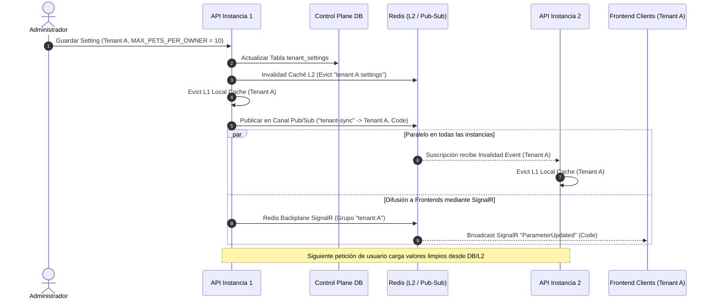
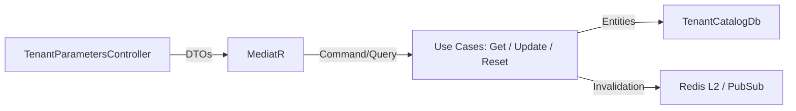
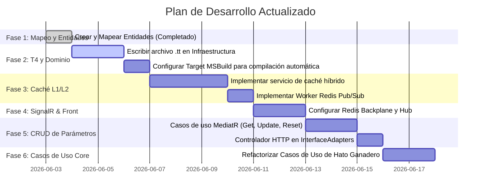

# Propuesta de Arquitectura: Sistema de Parametrización SaaS Multi-Tenant (T4 + Hybrid Cache + SignalR)

Esta propuesta detalla el diseño técnico para la implementación de un sistema de parametrización fuertemente tipado en **ZooTech**. Permite definir características (`features`), configuraciones (`setting_definitions`) y reglas de negocio (`rule_definitions`) en la base de datos de control plano (`TenantCatalogDb`), generar código estático mediante T4 y sincronizar los snapshots en memoria de múltiples instancias en tiempo real con Redis Pub/Sub y SignalR.

---

## 🏗️ 1. Arquitectura General y Flujo de Datos

Para soportar un entorno multi-instancia de alto rendimiento, se propone una **Caché Híbrida de Dos Niveles (L1/L2)** acoplada con un bus de invalidación por **Redis Pub/Sub** para la sincronización entre réplicas del backend y **SignalR** para clientes frontend.

### Diagrama de Sincronización y Caché (Multi-Instancia)



---

## 🏛️ 2. Estructura de Carpetas Propuesta (Con T4 en Infraestructura)

Los nuevos componentes se integran dentro de la estructura de **Clean Architecture** de la siguiente manera:

```text
ZooTech-Backend - Solution/
├── src/
│   ├── ZooTech.Domain/
│   │   ├── Parameters/               <-- Estructuras base de tipado
│   │   │   ├── FeatureDefinition.cs
│   │   │   ├── SettingDefinition.cs
│   │   │   └── RuleDefinition.cs
│   │   └── Generated/                <-- Archivo C# generado por el T4 de Infraestructura
│   │       └── ZooParameters.cs      <-- [GENERADO] Clases estáticas de definición
│   │
│   ├── ZooTech.Application/
│   │   ├── Common/
│   │   │   └── Gateway/
│   │   │       └── Configuration/    <-- Puertos de Acceso a Configuración
│   │   │           ├── ITenantConfiguration.cs
│   │   │           └── TenantConfigurationSnapshot.cs
│   │   └── Modules/
│   │       └── Module_Tenancing/     <-- NUEVO: Casos de uso CRUD de parámetros
│   │           └── UseCases/
│   │               ├── GetTenantConfiguration/
│   │               ├── UpdateTenantParameter/
│   │               └── ResetTenantParameter/
│   │
│   ├── ZooTech.Infrastructure/
│   │   ├── Configuration/            <-- NUEVO: Scripts de generación T4
│   │   │   └── ZooParameters.tt      <-- [T4] Compila BD y escribe en Domain
│   │   ├── Persistence/
│   │   │   ├── Context/
│   │   │   │   └── TenantCatalogDb.cs <-- [COMPLETADO] Mapeo de nuevas tablas
│   │   │   └── Entities/
│   │   │       └── MainTenantsDb/    <-- [COMPLETADO] Entidades de parametrización EF Core
│   │   └── Caching/                  <-- Implementación del Snapshot y Caché Híbrido
│   │       ├── TenantConfigurationService.cs
│   │       └── RedisSyncSubscriber.cs
│   │
│   ├── ZooTech.InterfaceAdapters/
│   │   ├── Modules/
│   │   │   └── Module_Tenancing/     <-- NUEVO: Controladores y DTOs CRUD de parámetros
│   │   │       ├── Controllers/
│   │   │       │   └── TenantParametersController.cs
│   │   │       └── DTOs/
│   │   └── SignalR/
│   │       ├── ParameterSyncHub.cs
│   │       └── HubGroups.cs
│   │
│   └── ZooTech.API/
│       ├── Program.cs
│       └── appsettings.json
```

---

## ⚡ 3. Decisiones Técnicas y Justificación

### A. Ubicación del T4: ¿Domain vs Infrastructure?
* **El Problema**: Los casos de uso (capa de `Application`) y el propio `Domain` necesitan consumir los parámetros fuertemente tipados (`ZooSettings.Billing.MaxPetsPerOwner`). Si generamos las clases estáticas dentro de la capa de `Infrastructure`, violaríamos la regla de dependencia de Clean Architecture, ya que `Application` y `Domain` no pueden referenciar a `Infrastructure`.
* **La Solución**: Colocar el archivo de diseño **`ZooParameters.tt` dentro de la capa de `Infrastructure`** (donde se concentran las dependencias de base de datos, ADO.NET y drivers de SQL Server), pero configurarlo para que escriba su salida compilada **`ZooParameters.cs` directamente en el directorio de `ZooTech.Domain`**.

### B. Compilación Automática de T4 (`ZooParameters.tt`)
Para automatizar la ejecución del archivo `.tt` y mantener sincronizado el código C# con los cambios de base de datos, se estructuran dos estrategias:

#### 1. Compilación Automática al Iniciar/Construir la Aplicación (MSBuild Target)
Se agrega un target de MSBuild en el archivo del proyecto `ZooTech.Infrastructure.csproj`. Este se ejecuta automáticamente antes de compilar la aplicación (en local, restauración de paquetes y procesos de CI/CD), garantizando que las clases de C# correspondan exactamente a lo que está en la base de datos de desarrollo antes de que levante el servidor de ASP.NET Core:

```xml
<!-- Añadir a ZooTech.Infrastructure.csproj -->
<Target Name="GenerateZooParameters" BeforeTargets="BeforeBuild">
  <Message Importance="High" Text="[T4] Regenerando parámetros de dominio a partir de la BD de control plano..." />
  <Exec Command="dotnet t4 $(ProjectDir)Configuration\ZooParameters.tt -o $(SolutionDir)src\ZooTech.Domain\Generated\ZooParameters.cs" />
</Target>
```
*   *(Nota: Requiere la instalación de la herramienta global de dotnet `dotnet-t4` ejecutando `dotnet tool restore` o `dotnet tool install --global dotnet-t4` en el entorno).*

#### 2. Compilación en Caliente ante Cambios en Base de Datos (File Watcher / Dev Watcher)
Durante el desarrollo, si un desarrollador o administrador agrega un nuevo setting/feature/rule a la base de datos del catálogo plano:
*   **Watcher de Base de Datos (Development Time)**: Se añade un script utilitario en la carpeta `scripts/watch-db-params.ps1` que sondea la tabla de definiciones cada 5 segundos buscando cambios en la fecha máxima de `updated_at`. Si detecta modificaciones, ejecuta la herramienta `dotnet-t4` para regenerar el archivo `.cs` al vuelo sin necesidad de detener y levantar manualmente el IDE.
*   **Soporte de Fallback Dinámico en Tiempo de Ejecución (Purity Loss Mitigation)**: Si se añade una nueva clave a la BD en producción/caliente y no se ha recompilado la aplicación, la clase estática de C# (`ZooSettings`) no tendrá la constante. El servicio de configuración híbrido debe resolver esto con elegancia: si un caso de uso solicita un string dinámico (vía método de escape de emergencia `_config.GetRaw("NUEVO_SETTING")`), la infraestructura lo resolverá desde base de datos sin lanzar excepciones catastróficas.

---

## 🏛️ 4. Flujo End-to-End: Visualización, Modificación y Eliminación (CRUD) de Parámetros

El CRUD de configuraciones se implementa desacoplado del acceso directo a base de datos del tenant, operando sobre el Control Plane DB (`TenantCatalogDb`).



### A. Capa de Dominio (Domain)
No requerimos lógica de negocio compleja para persistir estos registros, pero creamos DTOs de salida y puertos limpios.

### B. Capa de Aplicación (Application Use Cases)

#### 1. Obtener Configuración de un Tenant (`GetTenantConfiguration`)
*   **Query**: `GetTenantConfigurationQuery`
*   **Handler**: `GetTenantConfigurationQueryHandler`
*   Retorna la lista de todas las definiciones globales mezcladas con los valores asignados específicamente a ese tenant. Si el tenant no tiene un valor registrado, se indica que usa el "Global Default".

```csharp
namespace ZooTech.Application.Modules.Module_Tenancing.UseCases.GetTenantConfiguration;

using MediatR;

public record GetTenantConfigurationQuery(long TenantId) : IRequest<TenantConfigurationDto>;

public record TenantConfigurationDto(
    long TenantId,
    List<TenantSettingItemDto> Settings,
    List<TenantFeatureItemDto> Features
);

public record TenantSettingItemDto(string Code, string Name, string Category, string Value, string DefaultValue, bool IsCustomized);
public record TenantFeatureItemDto(string Code, string Name, string Category, bool IsEnabled, bool DefaultValue, bool IsCustomized);
```

Manejador de la Consulta:

```csharp
namespace ZooTech.Application.Modules.Module_Tenancing.UseCases.GetTenantConfiguration;

using MediatR;
using Microsoft.EntityFrameworkCore;
using ZooTech.Infrastructure.Persistence.Context;

public class GetTenantConfigurationQueryHandler : IRequestHandler<GetTenantConfigurationQuery, TenantConfigurationDto>
{
    private readonly TenantCatalogDb _context;

    public GetTenantConfigurationQueryHandler(TenantCatalogDb context)
    {
        _context = context;
    }

    public async Task<TenantConfigurationDto> Handle(GetTenantConfigurationQuery request, CancellationToken cancellationToken)
    {
        // 1. Obtener todas las definiciones globales de la plataforma
        var globalSettings = await _context.setting_definitions.ToListAsync(cancellationToken);
        var globalFeatures = await _context.features.Where(f => f.deleted_at == null).ToListAsync(cancellationToken);

        // 2. Obtener configuraciones personalizadas del Tenant específico
        var tenantSettings = await _context.tenant_settings
            .Where(ts => ts.tenant_id == request.TenantId)
            .ToDictionaryAsync(ts => ts.setting_definition_id, ts => ts.value, cancellationToken);

        var tenantFeatures = await _context.tenant_features
            .Where(tf => tf.tenant_id == request.TenantId)
            .ToDictionaryAsync(tf => tf.feature_id, tf => tf.is_enabled, cancellationToken);

        // 3. Cruzar datos (Merge)
        var settingsList = globalSettings.Select(def => {
            bool hasCustom = tenantSettings.TryGetValue(def.id, out var customValue);
            return new TenantSettingItemDto(
                def.code ?? "",
                def.name ?? "",
                def.category ?? "General",
                hasCustom ? customValue ?? "" : def.default_value ?? "",
                def.default_value ?? "",
                hasCustom
            );
        }).ToList();

        var featuresList = globalFeatures.Select(def => {
            bool hasCustom = tenantFeatures.TryGetValue(def.id, out var customVal);
            return new TenantFeatureItemDto(
                def.code,
                def.name,
                def.category ?? "General",
                hasCustom ? customVal : def.is_active,
                def.is_active,
                hasCustom
            );
        }).ToList();

        return new TenantConfigurationDto(request.TenantId, settingsList, featuresList);
    }
}
```

#### 2. Modificar Parámetro de un Tenant (`UpdateTenantParameter`)
*   **Command**: `UpdateTenantParameterCommand`
*   **Handler**: `UpdateTenantParameterCommandHandler`
*   Actualiza (o crea si no existía) la relación personalizada del tenant en `tenant_settings` o `tenant_features`. Invalida la caché local y publica la actualización.

```csharp
namespace ZooTech.Application.Modules.Module_Tenancing.UseCases.UpdateTenantParameter;

using MediatR;

public record UpdateTenantParameterCommand(
    long TenantId,
    string ParameterType, // "Setting" o "Feature"
    string Code,
    string Value // Si es Feature, pasa como "true" o "false"
) : IRequest<bool>;
```

Manejador del Comando:

```csharp
namespace ZooTech.Application.Modules.Module_Tenancing.UseCases.UpdateTenantParameter;

using MediatR;
using Microsoft.EntityFrameworkCore;
using StackExchange.Redis;
using ZooTech.Infrastructure.Persistence.Context;
using ZooTech.Infrastructure.Persistence.Entities.MainTenantsDb;

public class UpdateTenantParameterCommandHandler : IRequestHandler<UpdateTenantParameterCommand, bool>
{
    private readonly TenantCatalogDb _context;
    private readonly IConnectionMultiplexer _redis;

    public UpdateTenantParameterCommandHandler(TenantCatalogDb context, IConnectionMultiplexer redis)
    {
        _context = context;
        _redis = redis;
    }

    public async Task<bool> Handle(UpdateTenantParameterCommand request, CancellationToken cancellationToken)
    {
        bool isUpdated = false;

        if (request.ParameterType.Equals("Setting", StringComparison.OrdinalIgnoreCase))
        {
            var definition = await _context.setting_definitions
                .FirstOrDefaultAsync(sd => sd.code == request.Code, cancellationToken);
            if (definition == null) return false;

            var tenantSetting = await _context.tenant_settings
                .FirstOrDefaultAsync(ts => ts.tenant_id == request.TenantId && ts.setting_definition_id == definition.id, cancellationToken);

            if (tenantSetting == null)
            {
                tenantSetting = new tenant_setting
                {
                    tenant_id = request.TenantId,
                    setting_definition_id = definition.id,
                    value = request.Value,
                    updated_at = DateTimeOffset.UtcNow
                };
                _context.tenant_settings.Add(tenantSetting);
            }
            else
            {
                tenantSetting.value = request.Value;
                tenantSetting.updated_at = DateTimeOffset.UtcNow;
            }
            isUpdated = true;
        }
        else if (request.ParameterType.Equals("Feature", StringComparison.OrdinalIgnoreCase))
        {
            var feature = await _context.features
                .FirstOrDefaultAsync(f => f.code == request.Code && f.deleted_at == null, cancellationToken);
            if (feature == null) return false;

            var tenantFeature = await _context.tenant_features
                .FirstOrDefaultAsync(tf => tf.tenant_id == request.TenantId && tf.feature_id == feature.id, cancellationToken);

            bool isEnabledValue = bool.Parse(request.Value);

            if (tenantFeature == null)
            {
                tenantFeature = new tenant_feature
                {
                    tenant_id = request.TenantId,
                    feature_id = feature.id,
                    is_enabled = isEnabledValue,
                    enabled_at = DateTimeOffset.UtcNow,
                    updated_at = DateTimeOffset.UtcNow
                };
                _context.tenant_features.Add(tenantFeature);
            }
            else
            {
                tenantFeature.is_enabled = isEnabledValue;
                tenantFeature.updated_at = DateTimeOffset.UtcNow;
            }
            isUpdated = true;
        }

        if (isUpdated)
        {
            await _context.SaveChangesAsync(cancellationToken);

            // === PROCESO DE INVALIDACIÓN EN CASCADA ===
            var redisDb = _redis.GetDatabase();
            string cacheKey = $"tenant:{request.TenantId}:config";
            
            // 1. Eliminar de L2 (Redis)
            await redisDb.KeyDeleteAsync(cacheKey);

            // 2. Notificar a todas las APIs vía Pub/Sub (Evict de L1 local)
            var publisher = _redis.GetSubscriber();
            await publisher.PublishAsync("tenant-config-invalidation", request.TenantId.ToString());
        }

        return isUpdated;
    }
}
```

#### 3. Eliminar Configuración Personalizada / Restablecer por Defecto (`ResetTenantParameter`)
*   **Command**: `ResetTenantParameterCommand`
*   **Handler**: `ResetTenantParameterCommandHandler`
*   Elimina la personalización del tenant, obligando al sistema a resolver el valor por defecto global establecido en el catálogo.

```csharp
namespace ZooTech.Application.Modules.Module_Tenancing.UseCases.ResetTenantParameter;

using MediatR;

public record ResetTenantParameterCommand(
    long TenantId,
    string ParameterType, // "Setting" o "Feature"
    string Code
) : IRequest<bool>;
```

Manejador del Comando:

```csharp
namespace ZooTech.Application.Modules.Module_Tenancing.UseCases.ResetTenantParameter;

using MediatR;
using Microsoft.EntityFrameworkCore;
using StackExchange.Redis;
using ZooTech.Infrastructure.Persistence.Context;

public class ResetTenantParameterCommandHandler : IRequestHandler<ResetTenantParameterCommand, bool>
{
    private readonly TenantCatalogDb _context;
    private readonly IConnectionMultiplexer _redis;

    public ResetTenantParameterCommandHandler(TenantCatalogDb context, IConnectionMultiplexer redis)
    {
        _context = context;
        _redis = redis;
    }

    public async Task<bool> Handle(ResetTenantParameterCommand request, CancellationToken cancellationToken)
    {
        bool isDeleted = false;

        if (request.ParameterType.Equals("Setting", StringComparison.OrdinalIgnoreCase))
        {
            var setting = await _context.tenant_settings
                .FirstOrDefaultAsync(ts => ts.tenant_id == request.TenantId && ts.setting_definition.code == request.Code, cancellationToken);
            
            if (setting != null)
            {
                _context.tenant_settings.Remove(setting);
                isDeleted = true;
            }
        }
        else if (request.ParameterType.Equals("Feature", StringComparison.OrdinalIgnoreCase))
        {
            var feature = await _context.tenant_features
                .FirstOrDefaultAsync(tf => tf.tenant_id == request.TenantId && tf.feature.code == request.Code, cancellationToken);
            
            if (feature != null)
            {
                _context.tenant_features.Remove(feature);
                isDeleted = true;
            }
        }

        if (isDeleted)
        {
            await _context.SaveChangesAsync(cancellationToken);

            // === INVALIDACIÓN EN CASCADA ===
            var redisDb = _redis.GetDatabase();
            string cacheKey = $"tenant:{request.TenantId}:config";
            await redisDb.KeyDeleteAsync(cacheKey);

            var publisher = _redis.GetSubscriber();
            await publisher.PublishAsync("tenant-config-invalidation", request.TenantId.ToString());
        }

        return isDeleted;
    }
}
```

### C. Capa de Adaptadores de Interfaz (InterfaceAdapters)

#### Controladores e Interacción HTTP
El controlador expone los tres métodos necesarios para la administración de configuraciones del tenant. Recibe las llamadas HTTP, mapea los parámetros hacia los comandos de `MediatR` y retorna las estructuras.

```csharp
namespace ZooTech.InterfaceAdapters.Modules.Module_Tenancing.Controllers;

using MediatR;
using Microsoft.AspNetCore.Mvc;
using System.Threading.Tasks;
using ZooTech.Application.Modules.Module_Tenancing.UseCases.GetTenantConfiguration;
using ZooTech.Application.Modules.Module_Tenancing.UseCases.UpdateTenantParameter;
using ZooTech.Application.Modules.Module_Tenancing.UseCases.ResetTenantParameter;
using ZooTech.InterfaceAdapters.DTOs;

[ApiController]
[Route("api/v1/tenants/{tenantId}/parameters")]
public class TenantParametersController : ControllerBase
{
    private readonly IMediator _mediator;

    public TenantParametersController(IMediator mediator)
    {
        _mediator = mediator;
    }

    [HttpGet]
    public async Task<IActionResult> GetConfig(long tenantId)
    {
        var result = await _mediator.Send(new GetTenantConfigurationQuery(tenantId));
        return Ok(GeneralResponseDTO<TenantConfigurationDto>.Ok(result));
    }

    [HttpPut("{paramType}/{code}")]
    public async Task<IActionResult> UpdateConfig(
        long tenantId, 
        string paramType, 
        string code, 
        [FromBody] UpdateParameterRequest request)
    {
        var success = await _mediator.Send(new UpdateTenantParameterCommand(tenantId, paramType, code, request.Value));
        
        if (!success)
        {
            return BadRequest(GeneralResponseDTO<string>.Fail("No se pudo actualizar el parámetro. Valide el código y tipo."));
        }
        
        return Ok(GeneralResponseDTO<string>.Ok("Parámetro actualizado y propagado con éxito."));
    }

    [HttpDelete("{paramType}/{code}")]
    public async Task<IActionResult> ResetConfig(long tenantId, string paramType, string code)
    {
        var success = await _mediator.Send(new ResetTenantParameterCommand(tenantId, paramType, code));
        
        if (!success)
        {
            return BadRequest(GeneralResponseDTO<string>.Fail("No se pudo restablecer el parámetro o ya utiliza el valor predeterminado global."));
        }
        
        return Ok(GeneralResponseDTO<string>.Ok("Configuración del tenant restablecida al valor global."));
    }
}

public record UpdateParameterRequest(string Value);
```

---

## 📋 5. Plan de Sincronización e Implementación Actualizado

El plan contempla la adición de la fase de APIs para la administración de parámetros:



### Orden de Desarrollo Inmediato

1.  **Fase T4 y Automatización**:
    *   Definir los tipos `SettingDefinition`, `FeatureDefinition` y `RuleDefinition`.
    *   Escribir el Target de MSBuild en `ZooTech.Infrastructure.csproj`.
    *   Colocar la plantilla `ZooParameters.tt` en `ZooTech.Infrastructure/Configuration/`.
2.  **Caché e Infraestructura**: Implementar `TenantConfigurationService` y `RedisSyncSubscriber`.
3.  **Implementación CRUD de Parámetros (Fase 5)**:
    *   Crear los casos de uso en `ZooTech.Application` y el controlador `TenantParametersController` en `ZooTech.InterfaceAdapters` para habilitar el consumo de negocio.
4.  **SignalR**: Habilitar el hub de SignalR con el backplane de Redis y suscribir el frontend.
5.  **Propagación de Eventos**: Asegurar que al modificar configuraciones a través del API, se publique el evento de invalidación en Redis y SignalR.
