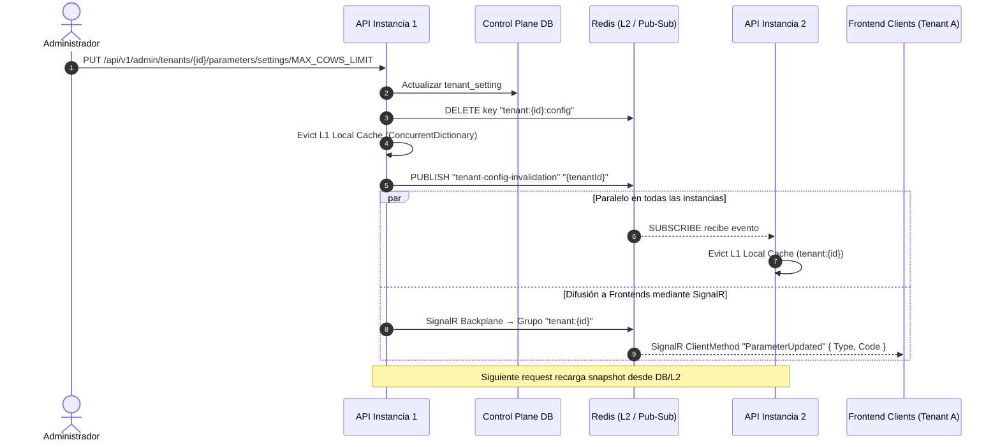
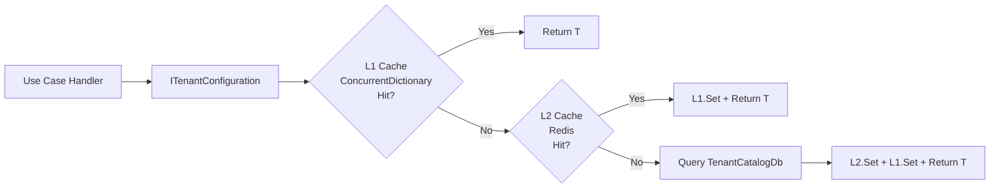

# Propuesta de Arquitectura: Sistema de Parametrización SaaS Multi-Tenant (T4 + Hybrid Cache + SignalR)

Esta propuesta detalla el diseño técnico para la implementación de un sistema de parametrización fuertemente tipado en **ZooTech**. Permite definir características (`features`), configuraciones (`setting_definitions`) y reglas de negocio (`rule_definitions`) en la base de datos de control plano (`TenantCatalogDb`), generar código estático mediante T4 y sincronizar los snapshots en memoria de múltiples instancias en tiempo real con Redis Pub/Sub y SignalR.

---

## 🏗️ 1. Arquitectura General y Flujo de Datos

Para soportar un entorno multi-instancia de alto rendimiento, se propone una **Caché Híbrida de Dos Niveles (L1/L2)** acoplada con un bus de invalidación por **Redis Pub/Sub** para la sincronización entre réplicas del backend y **SignalR** para clientes frontend.

### Diagrama de Sincronización y Caché (Multi-Instancia)



### Diagrama de Flujo de Lectura de Configuración (Casos de Uso)



---

## 🏛️ 2. Estructura de Carpetas Propuesta

Los nuevos componentes se integran dentro de la estructura de **Clean Architecture** respetando la regla de dependencias:

```text
ZooTech-Backend - Solution/
├── .config/
│   └── dotnet-tools.json                  ← NUEVO: Tool manifest para dotnet-t4
│
├── scripts/
│   └── watch-db-params.ps1                ← NUEVO: Watcher de BD en desarrollo
│
├── src/
│   ├── ZooTech.Domain/
│   │   ├── Parameters/                    ← NUEVO: Estructuras base tipadas
│   │   │   ├── SettingDefinition.cs       ← Definición genérica SettingDefinition<T>
│   │   │   ├── FeatureFlag.cs             ← Definición de feature flag
│   │   │   └── RuleSchema.cs              ← Definición de esquema de regla
│   │   └── Generated/                     ← NUEVO: Código generado por T4
│   │       └── ZooParameters.cs           ← [GENERADO] Clases estáticas de definición
│   │
│   ├── ZooTech.Application/
│   │   ├── Common/
│   │   │   └── Gateway/
│   │   │       ├── Configuration/         ← NUEVO: Puertos de acceso a configuración
│   │   │       │   ├── ITenantConfiguration.cs
│   │   │       │   ├── ITenantConfigurationRepository.cs
│   │   │       │   ├── ICacheInvalidationPublisher.cs
│   │   │       │   └── TenantConfigurationSnapshot.cs
│   │   │       └── SignalR/               ← NUEVO: Puerto de notificación SignalR
│   │   │           └── IParameterSyncNotifier.cs
│   │   └── Modules/
│   │       └── Module_Tenancing/
│   │           └── UseCases/
│   │               ├── GetTenantConfiguration/      ← NUEVO
│   │               ├── UpdateTenantParameter/        ← NUEVO
│   │               └── ResetTenantParameter/         ← NUEVO
│   │
│   ├── ZooTech.Infrastructure/
│   │   ├── Configuration/                 ← NUEVO: T4 Template
│   │   │   └── ZooParameters.tt
│   │   ├── Parameterization/              ← NUEVO: Implementaciones
│   │   │   ├── TenantConfigurationService.cs
│   │   │   ├── TenantConfigurationRepository.cs
│   │   │   ├── CacheInvalidationPublisher.cs
│   │   │   └── RedisSyncSubscriber.cs     ← IHostedService
│   │   ├── SignalR/                       ← NUEVO: Hub de SignalR
│   │   │   └── ParameterSyncHub.cs
│   │   └── Persistence/                   ← ✅ YA ACTUALIZADO
│   │       ├── Context/
│   │       │   └── TenantCatalogDb.cs     ← DbSets y Fluent API completos
│   │       └── Entities/MainTenantsDb/
│   │           ├── setting_group.cs       ← NUEVA entidad (grupos de settings)
│   │           ├── setting_definition.cs  ← ACTUALIZADA (FK a setting_group)
│   │           ├── setting_value.cs       ← NUEVA entidad (valores por tenant/actor)
│   │           ├── tenant_setting.cs      ← ⚠️ ORPHANED (sin DbSet, sin uso)
│   │           └── tenant.cs              ← Navegación setting_values (no tenant_settings)
│   │
│   ├── ZooTech.InterfaceAdapters/
│   │   ├── Modules/
│   │   │   └── Module_Tenancing/          ← NUEVOS endpoints y DTOs
│   │   │       ├── Controllers/
│   │   │       │   └── TenantParametersController.cs
│   │   │       ├── DTOs/
│   │   │       │   ├── Requests/
│   │   │       │   └── Responses/
│   │   │       └── Mappers/
│   │
│   └── ZooTech.API/
│       ├── Program.cs                     ← MODIFICADO: Registrar SignalR + nuevos servicios
│       └── appsettings.json               ← MODIFICADO: Agregar SignalR config
```

---

## 🚨 3. Estado Actual del Modelo de Datos y Correcciones Aplicadas

### ✅ Modelo de Entidades Actualizado (ya en código fuente)

Las entidades de parametrización han sido **rediseñadas completamente**. Los cambios clave vs. el diseño original:

| Cambio | Antes | Ahora |
|---|---|---|
| **PKs** | `long` en todas las entidades | `int` en todas las entidades |
| **Grupos de settings** | Campo `category` (string) en `setting_definition` | Entidad `setting_group` con FK `setting_group_id` |
| **Valores de tenant** | `tenant_setting` (clave compuesta, sin actor) | `setting_value` (PK auto, con `actor_type`/`actor_id`) |
| **Soft delete** | Solo en `feature` y `tenant` | Ahora también en `setting_definition`, `setting_group`, `setting_value`, `rule_definition`, `tenant_business_rule` |
| **`business_setting*`** | 3 entidades (business_setting, parameter, parameter_value) | **ELIMINADAS** del modelo |
| **`tenant_setting`** | En el modelo original | **ORPHANED** — archivo existe pero sin DbSet ni navegación |
| **Timestamps** | Mezcla `DateTime`/`DateTimeOffset` | Unificados a `DateTime?` |

### ✅ `TenantCatalogDb` ya cableado

El DbContext ya tiene todos los DbSets y Fluent API necesarios:

```csharp
DbSet<setting_group>       setting_groups        ✅ DbSet + Fluent API
DbSet<setting_definition>  setting_definitions   ✅ DbSet + Fluent API + FK→setting_group
DbSet<setting_value>       setting_values         ✅ DbSet + Fluent API + FK→tenant + FK→setting_definition
DbSet<feature>             features               ✅ DbSet + Fluent API
DbSet<tenant_feature>      tenant_features        ✅ DbSet + Fluent API (composite PK)
DbSet<rule_definition>     rule_definitions       ✅ DbSet + Fluent API
DbSet<tenant_business_rule> tenant_business_rules ✅ DbSet + Fluent API (composite PK)
DbSet<tenant>              tenants                ✅ DbSet + Fluent API + navegación setting_values
```

### ⛔ `tenant_setting.cs` es código muerto (IGNORAR)

El archivo `tenant_setting.cs` existe en `Persistence/Entities/MainTenantsDb/` pero:
- **No tiene DbSet** en `TenantCatalogDb`
- **No tiene Fluent API**
- **No tiene navegación** desde `tenant.cs`
- **Usa tipos `long`** inconsistentes con el modelo actual (`int`)
- **Usa `DateTimeOffset`** inconsistente con los `DateTime?` actuales

**Acción:** Eliminar este archivo antes de implementar la parametrización.

### ⚠️ Patrón `actor_type`/`actor_id` en `setting_value`

La nueva entidad `setting_value` usa un patrón polimórfico:
- `actor_type` (varchar 50, required): tipo de actor (ej: "TENANT", "BRANCH", "USER")
- `actor_id` (int?, nullable): ID específico del actor

Para operaciones CRUD simples a nivel tenant, se debe usar `actor_type = "TENANT"` y `actor_id = null` como convención.

### ⛔ `GeneralResponseDTO<T>` es `internal` (PENDIENTE)

**Problema:** La clase `GeneralResponseDTO<T>` en `Application.Common.Models` está marcada como `internal`, lo que impide usarla desde `InterfaceAdapters` (ensamblado diferente).

**Corrección:** Cambiar a `public` o crear un DTO equivalente en InterfaceAdapters.

### ⛔ Controller debe usar solo MediatR (PENDIENTE)

Todo el CRUD de parámetros se maneja via `IMediator.Send(command/query)`. El controller solo recibe/retorna DTOs. No debe inyectar `TenantCatalogDb`, `IConnectionMultiplexer` ni ningún tipo de Infrastructure directamente.

---

## 🏛️ 4. Especificación Detallada de Componentes

### A. Capa de Dominio (Domain) — Estructuras Tipadas

#### `SettingDefinition<T>` (Domain/Parameters/)

```csharp
namespace ZooTech.Domain.Parameters;

public class SettingDefinition<T>
{
    public string Code { get; }
    public string Group { get; }
    public T DefaultValue { get; }
    public string? Description { get; }
    public Type ValueType => typeof(T);

    public SettingDefinition(
        string code,
        string group,
        T defaultValue,
        string? description = null
    )
    {
        Code = code;
        Group = group;
        DefaultValue = defaultValue;
        Description = description;
    }
}
```

#### `FeatureFlag` (Domain/Parameters/)

```csharp
namespace ZooTech.Domain.Parameters;

public class FeatureFlag
{
    public string Code { get; }
    public string Category { get; }
    public bool DefaultValue { get; }
    public string? Description { get; }

    public FeatureFlag(
        string code,
        string category,
        bool defaultValue,
        string? description = null
    )
    {
        Code = code;
        Category = category;
        DefaultValue = defaultValue;
        Description = description;
    }
}
```

#### `RuleSchema` (Domain/Parameters/)

```csharp
namespace ZooTech.Domain.Parameters;

public class RuleSchema
{
    public string Code { get; }
    public string Module { get; }
    public string? ConditionSchema { get; }
    public string? ActionSchema { get; }

    public RuleSchema(
        string code,
        string module,
        string? conditionSchema = null,
        string? actionSchema = null
    )
    {
        Code = code;
        Module = module;
        ConditionSchema = conditionSchema;
        ActionSchema = actionSchema;
    }
}
```

#### Salida Generada por T4: `ZooParameters.cs`

Ejemplo de lo que el T4 debe generar basándose en la BD (agrupando por `setting_group.code`). El T4 resuelve el valor **efectivo** de cada setting usando `COALESCE(setting_values.value, setting_definitions.default_value)`, de modo que el `DefaultValue` del `SettingDefinition<T>` generado refleja el override del tenant cuando existe, o el valor global por defecto:

```csharp
// <auto-generated>
// Este archivo fue generado por ZooParameters.tt
// Generado: 2026-06-08 12:00:00 UTC
// NO EDITAR MANUALMENTE — ejecutar: dotnet t4 ZooParameters.tt
// </auto-generated>
namespace ZooTech.Domain.Generated;

using ZooTech.Domain.Parameters;

public static class ZooSettings
{
    public static class Billing
    {
        /// <summary>
        /// Límite de Vacunos Registrados
        /// Código: MAX_COWS_LIMIT | Tipo: INT
        /// </summary>
        public static readonly SettingDefinition<int> MaxCowsLimit =
            new("MAX_COWS_LIMIT", "Billing", 100, "Límite de Vacunos Registrados");

        /// <summary>
        /// Límite Máximo de Veterinarios Activos
        /// Código: MAX_VETERINARIANS_LIMIT | Tipo: INT
        /// </summary>
        public static readonly SettingDefinition<int> MaxVeterinariansLimit =
            new("MAX_VETERINARIANS_LIMIT", "Billing", 5, "Límite Máximo de Veterinarios Activos");
    }

    public static class General
    {
        /// <summary>
        /// Nombre de la empresa
        /// Código: COMPANY_NAME | Tipo: STRING
        /// </summary>
        public static readonly SettingDefinition<string> CompanyName =
            new("COMPANY_NAME", "General", "ZooTech", "Nombre de la empresa");
    }
}

public static class ZooFeatures
{
    public static class Production
    {
        /// <summary>
        /// Módulo de Análisis Avanzado de Calidad de Leche
        /// Código: PROD_MILK_ANALYSIS
        /// </summary>
        public static readonly FeatureFlag MilkAnalysis =
            new("PROD_MILK_ANALYSIS", "Production", true, "Módulo de Análisis Avanzado de Calidad de Leche");
    }
}

public static class ZooRules
{
    public static class Health
    {
        /// <summary>
        /// Recordatorio de vacunación
        /// Código: REMIND_VACCINATION
        /// </summary>
        public static readonly RuleSchema RemindVaccination =
            new("REMIND_VACCINATION", "Health");
    }
}
```

> **Notas:**
> - El T4 agrupa settings por el campo `setting_group.code` (no por un campo `category` que ya no existe). Las features siguen usando su campo `category`. Las rules usan su campo `module`.
> - El `DefaultValue` de cada `SettingDefinition<T>` es el valor **efectivo** resuelto por `COALESCE(sv.value, sd.default_value)`, lo que permite que en desarrollo el código generado refleje los overrides de un tenant específico cuando existen en `setting_values`.
> - Los códigos `UPPER_SNAKE_CASE` se convierten a `PascalCase` para los nombres de campos. Si un código inicia con dígito (ej. `3D_MODE`), se prefija con `_` (`_3DMode`).
> - Los valores JSON envueltos en la BD (`{"value": 42}`) se extraen mediante `ExtractJsonValue()` antes de asignarlos al `DefaultValue`.

### B. Capa de Aplicación (Application) — Puertos y Casos de Uso

#### Puerto: `ITenantConfiguration` (Gateway/Configuration/)

Interfaz principal que los casos de uso consumen para leer configuraciones tipadas:

```csharp
namespace ZooTech.Application.Common.Gateway.Configuration;

using ZooTech.Domain.Parameters;

public interface ITenantConfiguration
{
    T Get<T>(SettingDefinition<T> setting);
    bool IsEnabled(FeatureFlag feature);
    string? GetRaw(string code);
}
```

#### Puerto: `ITenantConfigurationRepository` (Gateway/Configuration/)

Repositorio abstracto para operaciones CRUD sobre la configuración del tenant. Opera sobre la tabla `setting_values`:

```csharp
namespace ZooTech.Application.Common.Gateway.Configuration;

public interface ITenantConfigurationRepository
{
    Task<TenantConfigurationSnapshot> GetSnapshotAsync(int tenantId);
    Task<bool> UpsertSettingAsync(int tenantId, string settingCode, string value);
    Task<bool> UpsertFeatureAsync(int tenantId, string featureCode, bool isEnabled);
    Task<bool> DeleteTenantSettingAsync(int tenantId, string settingCode);
    Task<bool> DeleteTenantFeatureAsync(int tenantId, string featureCode);
}
```

#### Puerto: `ICacheInvalidationPublisher` (Gateway/Configuration/)

Puerto para la invalidación de caché (L2 + Pub/Sub + SignalR):

```csharp
namespace ZooTech.Application.Common.Gateway.Configuration;

public interface ICacheInvalidationPublisher
{
    Task InvalidateTenantConfigAsync(int tenantId, string parameterType, string code);
}
```

#### Puerto: `IParameterSyncNotifier` (Gateway/SignalR/)

Puerto para notificar a clientes frontend via SignalR:

```csharp
namespace ZooTech.Application.Common.Gateway.SignalR;

public interface IParameterSyncNotifier
{
    Task NotifyParameterUpdatedAsync(int tenantId, string parameterType, string code);
}
```

#### Modelo: `TenantConfigurationSnapshot` (Gateway/Configuration/)

Snapshot de la configuración completa de un tenant:

```csharp
namespace ZooTech.Application.Common.Gateway.Configuration;

public class TenantConfigurationSnapshot
{
    public int TenantId { get; set; }
    public Dictionary<string, string> Settings { get; set; } = new();
    public Dictionary<string, bool> Features { get; set; } = new();
    public DateTimeOffset LoadedAt { get; set; } = DateTimeOffset.UtcNow;
}
```

#### Enum: `ParameterType`

Reemplaza el uso de strings "Setting"/"Feature" en los comandos:

```csharp
namespace ZooTech.Application.Modules.Module_Tenancing.UseCases;

public enum ParameterType
{
    Setting,
    Feature
}
```

#### Caso de Uso: `GetTenantConfiguration`

```
GetTenantConfiguration/
├── GetTenantConfigurationQuery.cs       ← IRequest<TenantConfigurationDto>
├── GetTenantConfigurationHandler.cs     ← IRequestHandler (usa ITenantConfigurationRepository)
├── GetTenantConfigurationValidator.cs   ← AbstractValidator
└── GetTenantConfigurationDto.cs         ← DTOs de salida
```

**Query:**
```csharp
namespace ZooTech.Application.Modules.Module_Tenancing.UseCases.GetTenantConfiguration;

using MediatR;

public record GetTenantConfigurationQuery(int TenantId) : IRequest<GetTenantConfigurationDto>;
```

**DTOs:**
```csharp
namespace ZooTech.Application.Modules.Module_Tenancing.UseCases.GetTenantConfiguration;

public record GetTenantConfigurationDto(
    int TenantId,
    List<SettingItemDto> Settings,
    List<FeatureItemDto> Features
);

public record SettingItemDto(
    string Code,
    string Name,
    string Group,
    string DataType,
    string Value,
    string DefaultValue,
    bool IsCustomized,
    string? ValidationSchema
);

public record FeatureItemDto(
    string Code,
    string Name,
    string Category,
    bool IsEnabled,
    bool DefaultValue,
    bool IsCustomized
);
```

> **Nota sobre `Category` en `FeatureItemDto`:** Las features mantienen su campo `category` (string) en la entidad EF. Solo los settings migraron a la entidad `setting_group`.

**Handler:**
```csharp
namespace ZooTech.Application.Modules.Module_Tenancing.UseCases.GetTenantConfiguration;

using MediatR;
using ZooTech.Application.Common.Gateway.Configuration;

public class GetTenantConfigurationHandler
    : IRequestHandler<GetTenantConfigurationQuery, GetTenantConfigurationDto>
{
    private readonly ITenantConfigurationRepository _repository;

    public GetTenantConfigurationHandler(ITenantConfigurationRepository repository)
    {
        _repository = repository;
    }

    public async Task<GetTenantConfigurationDto> Handle(
        GetTenantConfigurationQuery request,
        CancellationToken cancellationToken
    )
    {
        var snapshot = await _repository.GetSnapshotAsync(request.TenantId);
        // El handler construye el DTO cruzando definiciones globales con valores del tenant
        // La lógica de merge se implementa en el repositorio o aquí
        return snapshot.ToDto();
    }
}
```

**Validator:**
```csharp
namespace ZooTech.Application.Modules.Module_Tenancing.UseCases.GetTenantConfiguration;

using FluentValidation;

public class GetTenantConfigurationValidator : AbstractValidator<GetTenantConfigurationQuery>
{
    public GetTenantConfigurationValidator()
    {
        RuleFor(x => x.TenantId)
            .GreaterThan(0).WithMessage("El ID del tenant debe ser mayor a 0.");
    }
}
```

#### Caso de Uso: `UpdateTenantParameter`

```
UpdateTenantParameter/
├── UpdateTenantParameterCommand.cs
├── UpdateTenantParameterHandler.cs
└── UpdateTenantParameterValidator.cs
```

**Command:**
```csharp
namespace ZooTech.Application.Modules.Module_Tenancing.UseCases.UpdateTenantParameter;

using MediatR;
using ZooTech.Application.Modules.Module_Tenancing.UseCases;

public record UpdateTenantParameterCommand(
    int TenantId,
    ParameterType ParameterType,
    string Code,
    string Value
) : IRequest<bool>;
```

**Handler:**
```csharp
namespace ZooTech.Application.Modules.Module_Tenancing.UseCases.UpdateTenantParameter;

using MediatR;
using ZooTech.Application.Common.Gateway.Configuration;

public class UpdateTenantParameterHandler
    : IRequestHandler<UpdateTenantParameterCommand, bool>
{
    private readonly ITenantConfigurationRepository _repository;
    private readonly ICacheInvalidationPublisher _cachePublisher;
    private readonly IParameterSyncNotifier _signalRNotifier;

    public UpdateTenantParameterHandler(
        ITenantConfigurationRepository repository,
        ICacheInvalidationPublisher cachePublisher,
        IParameterSyncNotifier signalRNotifier
    )
    {
        _repository = repository;
        _cachePublisher = cachePublisher;
        _signalRNotifier = signalRNotifier;
    }

    public async Task<bool> Handle(
        UpdateTenantParameterCommand request,
        CancellationToken cancellationToken
    )
    {
        bool result = request.ParameterType switch
        {
            ParameterType.Setting => await _repository.UpsertSettingAsync(
                request.TenantId, request.Code, request.Value),
            ParameterType.Feature => await _repository.UpsertFeatureAsync(
                request.TenantId, request.Code, bool.Parse(request.Value)),
            _ => false
        };

        if (result)
        {
            await _cachePublisher.InvalidateTenantConfigAsync(
                request.TenantId,
                request.ParameterType.ToString(),
                request.Code
            );

            await _signalRNotifier.NotifyParameterUpdatedAsync(
                request.TenantId,
                request.ParameterType.ToString(),
                request.Code
            );
        }

        return result;
    }
}
```

**Validator:**
```csharp
namespace ZooTech.Application.Modules.Module_Tenancing.UseCases.UpdateTenantParameter;

using FluentValidation;

public class UpdateTenantParameterValidator : AbstractValidator<UpdateTenantParameterCommand>
{
    public UpdateTenantParameterValidator()
    {
        RuleFor(x => x.TenantId)
            .GreaterThan(0).WithMessage("El ID del tenant debe ser mayor a 0.");

        RuleFor(x => x.ParameterType)
            .IsInEnum().WithMessage("Tipo de parámetro inválido.");

        RuleFor(x => x.Code)
            .NotEmpty().WithMessage("El código del parámetro es requerido.")
            .MaximumLength(100).WithMessage("El código no puede exceder 100 caracteres.");

        RuleFor(x => x.Value)
            .NotNull().WithMessage("El valor no puede ser nulo.");
    }
}
```

#### Caso de Uso: `ResetTenantParameter`

```
ResetTenantParameter/
├── ResetTenantParameterCommand.cs
├── ResetTenantParameterHandler.cs
└── ResetTenantParameterValidator.cs
```

**Command:**
```csharp
namespace ZooTech.Application.Modules.Module_Tenancing.UseCases.ResetTenantParameter;

using MediatR;
using ZooTech.Application.Modules.Module_Tenancing.UseCases;

public record ResetTenantParameterCommand(
    int TenantId,
    ParameterType ParameterType,
    string Code
) : IRequest<bool>;
```

**Handler:**
```csharp
namespace ZooTech.Application.Modules.Module_Tenancing.UseCases.ResetTenantParameter;

using MediatR;
using ZooTech.Application.Common.Gateway.Configuration;

public class ResetTenantParameterHandler
    : IRequestHandler<ResetTenantParameterCommand, bool>
{
    private readonly ITenantConfigurationRepository _repository;
    private readonly ICacheInvalidationPublisher _cachePublisher;
    private readonly IParameterSyncNotifier _signalRNotifier;

    public ResetTenantParameterHandler(
        ITenantConfigurationRepository repository,
        ICacheInvalidationPublisher cachePublisher,
        IParameterSyncNotifier signalRNotifier
    )
    {
        _repository = repository;
        _cachePublisher = cachePublisher;
        _signalRNotifier = signalRNotifier;
    }

    public async Task<bool> Handle(
        ResetTenantParameterCommand request,
        CancellationToken cancellationToken
    )
    {
        bool result = request.ParameterType switch
        {
            ParameterType.Setting => await _repository.DeleteTenantSettingAsync(
                request.TenantId, request.Code),
            ParameterType.Feature => await _repository.DeleteTenantFeatureAsync(
                request.TenantId, request.Code),
            _ => false
        };

        if (result)
        {
            await _cachePublisher.InvalidateTenantConfigAsync(
                request.TenantId,
                request.ParameterType.ToString(),
                request.Code
            );

            await _signalRNotifier.NotifyParameterUpdatedAsync(
                request.TenantId,
                request.ParameterType.ToString(),
                request.Code
            );
        }

        return result;
    }
}
```

**Validator:**
```csharp
namespace ZooTech.Application.Modules.Module_Tenancing.UseCases.ResetTenantParameter;

using FluentValidation;

public class ResetTenantParameterValidator : AbstractValidator<ResetTenantParameterCommand>
{
    public ResetTenantParameterValidator()
    {
        RuleFor(x => x.TenantId)
            .GreaterThan(0).WithMessage("El ID del tenant debe ser mayor a 0.");

        RuleFor(x => x.ParameterType)
            .IsInEnum().WithMessage("Tipo de parámetro inválido.");

        RuleFor(x => x.Code)
            .NotEmpty().WithMessage("El código del parámetro es requerido.")
            .MaximumLength(100).WithMessage("El código no puede exceder 100 caracteres.");
    }
}
```

### C. Capa de Infraestructura (Infrastructure) — Implementaciones

#### `TenantConfigurationService` (Parameterization/)

Implementa `ITenantConfiguration` con caché híbrida L1/L2:

```csharp
namespace ZooTech.Infrastructure.Parameterization;

using System.Collections.Concurrent;
using System.Text.Json;
using ZooTech.Application.Common.Gateway.Configuration;
using ZooTech.Application.Common.Gateway.Context;
using ZooTech.Domain.Parameters;
using StackExchange.Redis;

public class TenantConfigurationService : ITenantConfiguration
{
    private readonly ITenantContext _tenantContext;
    private readonly ITenantConfigurationRepository _repository;
    private readonly IConnectionMultiplexer _redis;

    private static readonly ConcurrentDictionary<int, TenantConfigurationSnapshot> L1Cache = new();

    public TenantConfigurationService(
        ITenantContext tenantContext,
        ITenantConfigurationRepository repository,
        IConnectionMultiplexer redis
    )
    {
        _tenantContext = tenantContext;
        _repository = repository;
        _redis = redis;
    }

    public T Get<T>(SettingDefinition<T> setting)
    {
        var snapshot = GetOrLoadSnapshot();

        if (snapshot.Settings.TryGetValue(setting.Code, out var rawValue))
        {
            return ConvertValue<T>(rawValue, setting.DefaultValue);
        }

        return setting.DefaultValue;
    }

    public bool IsEnabled(FeatureFlag feature)
    {
        var snapshot = GetOrLoadSnapshot();

        if (snapshot.Features.TryGetValue(feature.Code, out var isEnabled))
        {
            return isEnabled;
        }

        return feature.DefaultValue;
    }

    public string? GetRaw(string code)
    {
        var snapshot = GetOrLoadSnapshot();

        return snapshot.Settings.TryGetValue(code, out var value) ? value : null;
    }

    public static void EvictL1(int tenantId)
    {
        L1Cache.TryRemove(tenantId, out _);
    }

    private TenantConfigurationSnapshot GetOrLoadSnapshot()
    {
        var tenantId = _tenantContext.TenantId;

        if (L1Cache.TryGetValue(tenantId, out var cached))
            return cached;

        var redisDb = _redis.GetDatabase();
        var redisKey = $"tenant:{tenantId}:config";
        var redisValue = redisDb.StringGet(redisKey);

        if (redisValue.HasValue)
        {
            var snapshot = JsonSerializer.Deserialize<TenantConfigurationSnapshot>(redisValue!);
            if (snapshot is not null)
            {
                L1Cache[tenantId] = snapshot;
                return snapshot;
            }
        }

        var loaded = _repository.GetSnapshotAsync(tenantId).GetAwaiter().GetResult();
        L1Cache[tenantId] = loaded;

        var serialized = JsonSerializer.Serialize(loaded);
        redisDb.StringSet(redisKey, serialized, TimeSpan.FromMinutes(10));

        return loaded;
    }

    private static T ConvertValue<T>(string rawValue, T fallback)
    {
        try
        {
            return (T)Convert.ChangeType(rawValue, typeof(T));
        }
        catch
        {
            return fallback;
        }
    }
}
```

#### `TenantConfigurationRepository` (Parameterization/)

Implementa `ITenantConfigurationRepository` usando `TenantCatalogDb`. Opera sobre `setting_values` con la convención `actor_type = "TENANT"` y `actor_id = null` para valores a nivel tenant:

```csharp
namespace ZooTech.Infrastructure.Parameterization;

using Microsoft.EntityFrameworkCore;
using ZooTech.Application.Common.Gateway.Configuration;
using ZooTech.Infrastructure.Persistence.Context;

public class TenantConfigurationRepository : ITenantConfigurationRepository
{
    private const string ActorTypeTenant = "TENANT";

    private readonly TenantCatalogDb _context;

    public TenantConfigurationRepository(TenantCatalogDb context)
    {
        _context = context;
    }

    public async Task<TenantConfigurationSnapshot> GetSnapshotAsync(int tenantId)
    {
        var globalSettings = await _context.setting_definitions
            .AsNoTracking()
            .Where(sd => sd.is_active && sd.deleted_at == null)
            .Include(sd => sd.setting_group)
            .ToListAsync();

        var tenantValues = await _context.setting_values
            .AsNoTracking()
            .Where(sv => sv.tenant_id == tenantId
                && sv.actor_type == ActorTypeTenant
                && sv.actor_id == null
                && sv.is_active
                && sv.deleted_at == null)
            .ToDictionaryAsync(sv => sv.setting_definition_id, sv => sv.value);

        var globalFeatures = await _context.features
            .AsNoTracking()
            .Where(f => f.is_active && f.deleted_at == null)
            .ToListAsync();

        var tenantFeatures = await _context.tenant_features
            .AsNoTracking()
            .Where(tf => tf.tenant_id == tenantId)
            .ToDictionaryAsync(tf => tf.feature_id, tf => tf.is_enabled);

        var settings = new Dictionary<string, string>();
        foreach (var def in globalSettings)
        {
            var value = tenantValues.TryGetValue(def.id, out var custom)
                ? custom
                : def.default_value ?? "";
            settings[def.code] = value;
        }

        var features = new Dictionary<string, bool>();
        foreach (var feat in globalFeatures)
        {
            var isEnabled = tenantFeatures.TryGetValue(feat.id, out var custom)
                ? custom
                : feat.is_active;
            features[feat.code] = isEnabled;
        }

        return new TenantConfigurationSnapshot
        {
            TenantId = tenantId,
            Settings = settings,
            Features = features,
            LoadedAt = DateTimeOffset.UtcNow
        };
    }

    public async Task<bool> UpsertSettingAsync(int tenantId, string settingCode, string value)
    {
        var definition = await _context.setting_definitions
            .FirstOrDefaultAsync(sd => sd.code == settingCode && sd.is_active && sd.deleted_at == null);

        if (definition is null) return false;

        var existing = await _context.setting_values
            .FirstOrDefaultAsync(sv => sv.tenant_id == tenantId
                && sv.setting_definition_id == definition.id
                && sv.actor_type == ActorTypeTenant
                && sv.actor_id == null
                && sv.deleted_at == null);

        if (existing is null)
        {
            _context.setting_values.Add(new()
            {
                tenant_id = tenantId,
                setting_definition_id = definition.id,
                actor_type = ActorTypeTenant,
                actor_id = null,
                value = value,
                is_active = true,
                created_at = DateTime.UtcNow,
                updated_at = DateTime.UtcNow
            });
        }
        else
        {
            existing.value = value;
            existing.updated_at = DateTime.UtcNow;
        }

        await _context.SaveChangesAsync();
        return true;
    }

    public async Task<bool> UpsertFeatureAsync(int tenantId, string featureCode, bool isEnabled)
    {
        var feature = await _context.features
            .FirstOrDefaultAsync(f => f.code == featureCode && f.deleted_at == null);

        if (feature is null) return false;

        var existing = await _context.tenant_features
            .FirstOrDefaultAsync(tf => tf.tenant_id == tenantId
                && tf.feature_id == feature.id);

        if (existing is null)
        {
            _context.tenant_features.Add(new()
            {
                tenant_id = tenantId,
                feature_id = feature.id,
                is_enabled = isEnabled,
                enabled_at = DateTime.UtcNow,
                updated_at = DateTime.UtcNow
            });
        }
        else
        {
            existing.is_enabled = isEnabled;
            existing.updated_at = DateTime.UtcNow;
        }

        await _context.SaveChangesAsync();
        return true;
    }

    public async Task<bool> DeleteTenantSettingAsync(int tenantId, string settingCode)
    {
        var definition = await _context.setting_definitions
            .FirstOrDefaultAsync(sd => sd.code == settingCode && sd.deleted_at == null);

        if (definition is null) return false;

        var existing = await _context.setting_values
            .FirstOrDefaultAsync(sv => sv.tenant_id == tenantId
                && sv.setting_definition_id == definition.id
                && sv.actor_type == ActorTypeTenant
                && sv.actor_id == null
                && sv.deleted_at == null);

        if (existing is null) return false;

        existing.deleted_at = DateTime.UtcNow;
        existing.is_active = false;
        await _context.SaveChangesAsync();
        return true;
    }

    public async Task<bool> DeleteTenantFeatureAsync(int tenantId, string featureCode)
    {
        var feature = await _context.features
            .FirstOrDefaultAsync(f => f.code == featureCode && f.deleted_at == null);

        if (feature is null) return false;

        var existing = await _context.tenant_features
            .FirstOrDefaultAsync(tf => tf.tenant_id == tenantId
                && tf.feature_id == feature.id);

        if (existing is null) return false;

        _context.tenant_features.Remove(existing);
        await _context.SaveChangesAsync();
        return true;
    }
}
```

> **Convención `actor_type`:** Para valores a nivel de tenant se usa `actor_type = "TENANT"` y `actor_id = null`. Esto permite que en el futuro otros actores (sucursales, usuarios) tengan sus propios valores sin modificar la estructura.

#### `CacheInvalidationPublisher` (Parameterization/)

Implementa `ICacheInvalidationPublisher`:

```csharp
namespace ZooTech.Infrastructure.Parameterization;

using StackExchange.Redis;
using ZooTech.Application.Common.Gateway.Configuration;

public class CacheInvalidationPublisher : ICacheInvalidationPublisher
{
    private readonly IConnectionMultiplexer _redis;

    public CacheInvalidationPublisher(IConnectionMultiplexer redis)
    {
        _redis = redis;
    }

    public async Task InvalidateTenantConfigAsync(
        int tenantId,
        string parameterType,
        string code
    )
    {
        var db = _redis.GetDatabase();
        var cacheKey = $"tenant:{tenantId}:config";

        await db.KeyDeleteAsync(cacheKey);

        TenantConfigurationService.EvictL1(tenantId);

        var subscriber = _redis.GetSubscriber();
        await subscriber.PublishAsync(
            new RedisChannel("tenant-config-invalidation", RedisChannel.PatternMode.Literal),
            tenantId.ToString()
        );
    }
}
```

#### `RedisSyncSubscriber` (Parameterization/) — IHostedService

```csharp
namespace ZooTech.Infrastructure.Parameterization;

using Microsoft.Extensions.Hosting;
using StackExchange.Redis;

public class RedisSyncSubscriber : BackgroundService
{
    private readonly IConnectionMultiplexer _redis;

    public RedisSyncSubscriber(IConnectionMultiplexer redis)
    {
        _redis = redis;
    }

    protected override Task ExecuteAsync(CancellationToken stoppingToken)
    {
        var subscriber = _redis.GetSubscriber();

        subscriber.Subscribe(
            new RedisChannel("tenant-config-invalidation", RedisChannel.PatternMode.Literal),
            (channel, message) =>
            {
                if (int.TryParse(message, out var tenantId))
                {
                    TenantConfigurationService.EvictL1(tenantId);
                }
            }
        );

        return Task.CompletedTask;
    }

    public override Task StopAsync(CancellationToken cancellationToken)
    {
        _redis.GetSubscriber().UnsubscribeAll();
        return base.StopAsync(cancellationToken);
    }
}
```

#### `SignalRNotifier` (Parameterization/)

Implementa `IParameterSyncNotifier`:

```csharp
namespace ZooTech.Infrastructure.Parameterization;

using Microsoft.AspNetCore.SignalR;
using ZooTech.Application.Common.Gateway.SignalR;
using ZooTech.Infrastructure.SignalR;

public class SignalRNotifier : IParameterSyncNotifier
{
    private readonly IHubContext<ParameterSyncHub> _hubContext;

    public SignalRNotifier(IHubContext<ParameterSyncHub> hubContext)
    {
        _hubContext = hubContext;
    }

    public async Task NotifyParameterUpdatedAsync(
        int tenantId,
        string parameterType,
        string code
    )
    {
        await _hubContext.Clients
            .Group($"tenant:{tenantId}")
            .SendAsync("ParameterUpdated", new
            {
                Type = parameterType,
                Code = code,
                UpdatedAt = DateTimeOffset.UtcNow
            });
    }
}
```

> **Ubicación del Hub:** Tanto `ParameterSyncHub` como `SignalRNotifier` residen en `Infrastructure` (`Infrastructure/SignalR/` y `Infrastructure/Parameterization/`), evitando la dependencia circular con InterfaceAdapters.

### D. SignalR Hub (Infrastructure/SignalR/)

```csharp
namespace ZooTech.Infrastructure.SignalR;

using Microsoft.AspNetCore.SignalR;

public class ParameterSyncHub : Hub
{
    public override async Task OnConnectedAsync()
    {
        var tenantId = Context.GetHttpContext()?.Request.Query["tenantId"].ToString();

        if (!string.IsNullOrEmpty(tenantId))
        {
            await Groups.AddToGroupAsync(Context.ConnectionId, $"tenant:{tenantId}");
        }

        await base.OnConnectedAsync();
    }

    public override async Task OnDisconnectedAsync(Exception? exception)
    {
        var tenantId = Context.GetHttpContext()?.Request.Query["tenantId"].ToString();

        if (!string.IsNullOrEmpty(tenantId))
        {
            await Groups.RemoveFromGroupAsync(Context.ConnectionId, $"tenant:{tenantId}");
        }

        await base.OnDisconnectedAsync(exception);
    }
}
```

### E. InterfaceAdapters — Controller y DTOs

#### `TenantParametersController`

```csharp
namespace ZooTech.InterfaceAdapters.Modules.Module_Tenancing.Controllers;

using MediatR;
using Microsoft.AspNetCore.Mvc;
using ZooTech.Application.Modules.Module_Tenancing.UseCases;
using ZooTech.Application.Modules.Module_Tenancing.UseCases.GetTenantConfiguration;
using ZooTech.Application.Modules.Module_Tenancing.UseCases.UpdateTenantParameter;
using ZooTech.Application.Modules.Module_Tenancing.UseCases.ResetTenantParameter;

[ApiController]
[Route("api/v1/admin/tenants/{tenantId}/parameters")]
public class TenantParametersController : ControllerBase
{
    private readonly IMediator _mediator;

    public TenantParametersController(IMediator mediator)
    {
        _mediator = mediator;
    }

    [HttpGet]
    public async Task<IActionResult> GetConfig(long tenantId)
    {
        var result = await _mediator.Send(new GetTenantConfigurationQuery(tenantId));
        return Ok(new { success = true, data = result });
    }

    [HttpPut("{paramType}/{code}")]
    public async Task<IActionResult> UpdateConfig(
        long tenantId,
        string paramType,
        string code,
        [FromBody] UpdateParameterRequestDto request
    )
    {
        if (!Enum.TryParse<ParameterType>(paramType, true, out var type))
            return BadRequest(new { success = false, error = "Tipo de parámetro inválido. Use 'Setting' o 'Feature'." });

        var result = await _mediator.Send(new UpdateTenantParameterCommand(tenantId, type, code, request.Value));

        if (!result)
            return NotFound(new { success = false, error = "Parámetro no encontrado." });

        return Ok(new { success = true, message = "Parámetro actualizado y propagado." });
    }

    [HttpDelete("{paramType}/{code}")]
    public async Task<IActionResult> ResetConfig(long tenantId, string paramType, string code)
    {
        if (!Enum.TryParse<ParameterType>(paramType, true, out var type))
            return BadRequest(new { success = false, error = "Tipo de parámetro inválido. Use 'Setting' o 'Feature'." });

        var result = await _mediator.Send(new ResetTenantParameterCommand(tenantId, type, code));

        if (!result)
            return NotFound(new { success = false, error = "Configuración personalizada no encontrada." });

        return Ok(new { success = true, message = "Configuración restablecida al valor global." });
    }
}
```

#### DTO de Request

```csharp
namespace ZooTech.InterfaceAdapters.Modules.Module_Tenancing.DTOs.Requests;

public record UpdateParameterRequestDto(string Value);
```

---

## ⚡ 5. T4 Template — `ZooParameters.tt` (Enfoque Fusionado)

### Ubicación
`src/ZooTech.Infrastructure/Configuration/ZooParameters.tt`

### Pre-requisitos
1. Instalar herramienta: `dotnet tool install dotnet-t4`
2. Crear manifest: `.config/dotnet-tools.json`

```json
{
  "version": 1,
  "isRoot": true,
  "tools": {
    "dotnet-t4": {
      "version": "3.0.0",
      "commands": ["t4"]
    }
  }
}
```

### Comando de generación manual

```powershell
dotnet t4 src/ZooTech.Infrastructure/Configuration/ZooParameters.tt -o src/ZooTech.Domain/Generated/ZooParameters.cs
```

### MSBuild Target (agregar a `ZooTech.Infrastructure.csproj`)

```xml
<Target Name="GenerateZooParameters" BeforeTargets="BeforeBuild">
  <Message Importance="High" Text="[T4] Regenerando parámetros de dominio desde BD..." />
  <Exec Command="dotnet t4 &quot;$(ProjectDir)Configuration\ZooParameters.tt&quot; -o &quot;$(SolutionDir)src\ZooTech.Domain\Generated\ZooParameters.cs&quot;"
        IgnoreExitCode="true" />
</Target>
```

> **Nota:** `IgnoreExitCode="true"` permite que el build continúe si el T4 falla (ej. sin conexión a BD).

### Archivo completo: `ZooParameters.tt`

El siguiente es el contenido íntegro del template T4 fusionado. Combina la **type-safety** del plan original (`SettingDefinition<T>`, `FeatureFlag`, `RuleSchema`) con las **mejoras operativas** del template alternativo (`COALESCE`, `ExtractJsonValue`, `FormatValue`, `ToPascalCase` robusto).

| Principio | Detalle |
|---|---|
| **Driver SQL** | `Microsoft.Data.SqlClient` (consistente con EF Core del proyecto, **no** `System.Data.SqlClient`) |
| **Connection string** | Leída de `appsettings.Development.json` → `ConnectionStrings:TenantCatalogConnection` (nunca hardcodeada) |
| **Resolución de valores** | `COALESCE(sv.value, sd.default_value)` para que `DefaultValue` refleje el override del tenant si existe |
| **Salida tipada** | `SettingDefinition<T>`, `FeatureFlag`, `RuleSchema` (mantiene compatibilidad con `ITenantConfiguration`) |
| **Limpieza JSON** | `ExtractJsonValue()` extrae el valor real de JSON envuelto (`{"value": 42}` → `42`) |
| **Formato de valores** | `FormatValue()` escapa correctamente strings, sufijo `m` en decimals, lowercase en bools |
| **Nombres de campos** | `ToPascalCase()` convierte `UPPER_SNAKE_CASE` → `PascalCase`, prefijo `_` si inicia con dígito |
| **Error handling** | Try/catch global: si la BD no está disponible, genera un stub vacío que compila |

```t4
<#@ template language="C#" debug="false" hostspecific="true" #>
<#@ output extension=".cs" #>
<#@ assembly name="System.Core" #>
<#@ assembly name="System.Data" #>
<#@ assembly name="Microsoft.Data.SqlClient" #>
<#@ import namespace="System" #>
<#@ import namespace="System.Linq" #>
<#@ import namespace="System.Text" #>
<#@ import namespace="System.Collections.Generic" #>
<#@ import namespace="Microsoft.Data.SqlClient" #>
<#@ import namespace="System.Text.RegularExpressions" #>
<#@ import namespace="System.IO" #>
<#
    // ============================================================
    // 1. Leer connection string desde appsettings.Development.json
    // ============================================================
    string templateDir = Path.GetDirectoryName(Host.ResolvePath(""));
    string appSettingsPath = Path.GetFullPath(
        Path.Combine(templateDir, "..", "..", "src", "ZooTech.API", "appsettings.Development.json"));

    string connectionString = "";
    if (File.Exists(appSettingsPath))
    {
        string json = File.ReadAllText(appSettingsPath);
        var csMatch = Regex.Match(json, "\"TenantCatalogConnection\"\\s*:\\s*\"([^\"]+)\"");
        if (csMatch.Success)
            connectionString = csMatch.Groups[1].Value;
    }

    // ============================================================
    // 2. Si la connection string está vacía, generar stub vacío
    // ============================================================
    if (string.IsNullOrWhiteSpace(connectionString))
    {
#>
// <auto-generated>
// WARNING: Generado como stub vacío — connection string no disponible.
// Verificar appsettings.Development.json → ConnectionStrings:TenantCatalogConnection
// Generado: <#= DateTime.UtcNow.ToString("yyyy-MM-dd HH:mm:ss") #> UTC
// </auto-generated>
namespace ZooTech.Domain.Generated;

using ZooTech.Domain.Parameters;

public static class ZooSettings { }
public static class ZooFeatures { }
public static class ZooRules { }
<#
        return;
    }

    // ============================================================
    // 3. Consultar BD y generar código tipado
    // ============================================================
    var settings = new Dictionary<string, List<ParameterItem>>();
    var features = new Dictionary<string, List<FeatureItem>>();
    var rules = new Dictionary<string, List<RuleItem>>();

    try
    {
        using (var connection = new SqlConnection(connectionString))
        {
            connection.Open();

            // --- Query 1: Settings con valor efectivo (COALESCE) ---
            string settingsQuery = @"
                SELECT
                    sd.code        AS SettingCode,
                    sd.name        AS SettingName,
                    sd.description AS SettingDescription,
                    sd.data_type   AS DataType,
                    COALESCE(sv.value, sd.default_value) AS FinalValue,
                    sg.code        AS GroupCode
                FROM dbo.setting_definitions sd
                INNER JOIN dbo.setting_groups sg
                    ON sd.setting_group_id = sg.id
                LEFT JOIN dbo.setting_values sv
                    ON sd.id = sv.setting_definition_id
                    AND sv.actor_type = 'TENANT'
                    AND sv.actor_id IS NULL
                    AND sv.is_active = 1
                    AND sv.deleted_at IS NULL
                WHERE sd.is_active = 1
                  AND sd.deleted_at IS NULL
                  AND sg.is_active = 1
                  AND sg.deleted_at IS NULL
                ORDER BY sg.code, sd.code;";

            using (var cmd = new SqlCommand(settingsQuery, connection))
            using (var reader = cmd.ExecuteReader())
            {
                while (reader.Read())
                {
                    string groupCode = reader["GroupCode"].ToString();
                    if (!settings.ContainsKey(groupCode))
                        settings[groupCode] = new List<ParameterItem>();

                    settings[groupCode].Add(new ParameterItem
                    {
                        Code = reader["SettingCode"].ToString(),
                        Name = reader["SettingName"].ToString(),
                        Description = reader["SettingDescription"]?.ToString() ?? "",
                        DataType = reader["DataType"].ToString(),
                        Value = ExtractJsonValue(reader["FinalValue"]?.ToString() ?? "")
                    });
                }
            }

            // --- Query 2: Features ---
            string featuresQuery = @"
                SELECT code, name, category, description, is_active
                FROM dbo.features
                WHERE deleted_at IS NULL
                ORDER BY category, code;";

            using (var cmd = new SqlCommand(featuresQuery, connection))
            using (var reader = cmd.ExecuteReader())
            {
                while (reader.Read())
                {
                    string category = reader["category"]?.ToString() ?? "General";
                    if (!features.ContainsKey(category))
                        features[category] = new List<FeatureItem>();

                    features[category].Add(new FeatureItem
                    {
                        Code = reader["code"].ToString(),
                        Name = reader["name"].ToString(),
                        Description = reader["description"]?.ToString() ?? "",
                        IsActive = (bool)reader["is_active"]
                    });
                }
            }

            // --- Query 3: Rules ---
            string rulesQuery = @"
                SELECT code, name, module, description, condition_schema, action_schema
                FROM dbo.rule_definitions
                WHERE deleted_at IS NULL
                ORDER BY module, code;";

            using (var cmd = new SqlCommand(rulesQuery, connection))
            using (var reader = cmd.ExecuteReader())
            {
                while (reader.Read())
                {
                    string module = reader["module"]?.ToString() ?? "General";
                    if (!rules.ContainsKey(module))
                        rules[module] = new List<RuleItem>();

                    rules[module].Add(new RuleItem
                    {
                        Code = reader["code"].ToString(),
                        Name = reader["name"].ToString(),
                        Description = reader["description"]?.ToString() ?? "",
                        ConditionSchema = reader["condition_schema"]?.ToString(),
                        ActionSchema = reader["action_schema"]?.ToString()
                    });
                }
            }
        }
    }
    catch (Exception ex)
    {
#>
// <auto-generated>
// WARNING: Error al conectar con la base de datos. Generado como stub vacío.
// Error: <#= ex.Message #>
// Generado: <#= DateTime.UtcNow.ToString("yyyy-MM-dd HH:mm:ss") #> UTC
// </auto-generated>
namespace ZooTech.Domain.Generated;

using ZooTech.Domain.Parameters;

public static class ZooSettings { }
public static class ZooFeatures { }
public static class ZooRules { }
<#
        return;
    }

    // ============================================================
    // 4. Generar salida tipada
    // ============================================================
#>
// <auto-generated>
// Este archivo fue generado por ZooParameters.tt
// Generado: <#= DateTime.UtcNow.ToString("yyyy-MM-dd HH:mm:ss") #> UTC
// NO EDITAR MANUALMENTE — ejecutar: dotnet t4 ZooParameters.tt
// </auto-generated>
namespace ZooTech.Domain.Generated;

using ZooTech.Domain.Parameters;

public static class ZooSettings
{
<#
    foreach (var group in settings.OrderBy(g => g.Key))
    {
        string className = ToPascalCase(group.Key);
#>
    public static class <#= className #>
    {
<#
        foreach (var item in group.Value)
        {
            string fieldName = ToPascalCase(item.Code);
            string csharpType = MapToCSharpType(item.DataType);
            string defaultValue = FormatValue(item.Value, csharpType);
#>
        /// <summary>
        /// <#= item.Name #>
        /// Código: <#= item.Code #> | Tipo: <#= item.DataType #>
        /// </summary>
        public static readonly SettingDefinition<<#= csharpType #>> <#= fieldName #> =
            new("<#= item.Code #>", "<#= group.Key #>", <#= defaultValue #>, "<#= item.Description.Replace("\"", "\\\"") #>");

<#
        }
#>
    }

<#
    }
#>
}

public static class ZooFeatures
{
<#
    foreach (var category in features.OrderBy(f => f.Key))
    {
        string className = ToPascalCase(category.Key);
#>
    public static class <#= className #>
    {
<#
        foreach (var item in category.Value)
        {
            string fieldName = ToPascalCase(item.Code);
            string boolValue = item.IsActive ? "true" : "false";
#>
        /// <summary>
        /// <#= item.Name #>
        /// Código: <#= item.Code #>
        /// </summary>
        public static readonly FeatureFlag <#= fieldName #> =
            new("<#= item.Code #>", "<#= category.Key #>", <#= boolValue #>, "<#= item.Description.Replace("\"", "\\\"") #>");

<#
        }
#>
    }

<#
    }
#>
}

public static class ZooRules
{
<#
    foreach (var module in rules.OrderBy(r => r.Key))
    {
        string className = ToPascalCase(module.Key);
#>
    public static class <#= className #>
    {
<#
        foreach (var item in module.Value)
        {
            string fieldName = ToPascalCase(item.Code);
            string condSchema = item.ConditionSchema != null
                ? "\"" + item.ConditionSchema.Replace("\\", "\\\\").Replace("\"", "\\\"") + "\""
                : "null";
            string actSchema = item.ActionSchema != null
                ? "\"" + item.ActionSchema.Replace("\\", "\\\\").Replace("\"", "\\\"") + "\""
                : "null";
#>
        /// <summary>
        /// <#= item.Name #>
        /// Código: <#= item.Code #>
        /// </summary>
        public static readonly RuleSchema <#= fieldName #> =
            new("<#= item.Code #>", "<#= module.Key #>", <#= condSchema #>, <#= actSchema #>);

<#
        }
#>
    }

<#
    }
#>
}
<#+
    // ============================================================
    // Clases auxiliares
    // ============================================================

    public class ParameterItem
    {
        public string Code { get; set; }
        public string Name { get; set; }
        public string Description { get; set; }
        public string DataType { get; set; }
        public string Value { get; set; }
    }

    public class FeatureItem
    {
        public string Code { get; set; }
        public string Name { get; set; }
        public string Description { get; set; }
        public bool IsActive { get; set; }
    }

    public class RuleItem
    {
        public string Code { get; set; }
        public string Name { get; set; }
        public string Description { get; set; }
        public string ConditionSchema { get; set; }
        public string ActionSchema { get; set; }
    }

    // ============================================================
    // Funciones helper
    // ============================================================

    public string ExtractJsonValue(string rawValue)
    {
        if (string.IsNullOrWhiteSpace(rawValue))
            return string.Empty;

        string value = rawValue.Trim();

        Match match = Regex.Match(
            value,
            "\"value\"\\s*:\\s*(\"(?:\\\\.|[^\"])*\"|true|false|null|-?\\d+(?:\\.\\d+)?)",
            RegexOptions.IgnoreCase);

        if (!match.Success)
            return value;

        string extracted = match.Groups[1].Value.Trim();

        if (extracted.StartsWith("\"") && extracted.EndsWith("\"") && extracted.Length >= 2)
        {
            extracted = extracted.Substring(1, extracted.Length - 2);
            extracted = extracted.Replace("\\\"", "\"").Replace("\\\\", "\\");
        }

        return extracted;
    }

    public string MapToCSharpType(string dataType)
    {
        if (string.IsNullOrWhiteSpace(dataType))
            return "string";

        switch (dataType.ToUpper())
        {
            case "INT":
            case "INTEGER":
                return "int";
            case "DECIMAL":
            case "NUMERIC":
            case "MONEY":
                return "decimal";
            case "BOOLEAN":
            case "BOOL":
            case "BIT":
                return "bool";
            case "STRING":
            case "VARCHAR":
            case "NVARCHAR":
            case "TEXT":
                return "string";
            case "DATE":
            case "DATETIME":
                return "string";
            case "JSON":
            case "ARRAY":
                return "string";
            default:
                return "string";
        }
    }

    public string FormatValue(string value, string csharpType)
    {
        if (string.IsNullOrWhiteSpace(value) || value.Trim().ToLower() == "null")
        {
            if (csharpType == "string") return "\"\"";
            if (csharpType == "int") return "0";
            if (csharpType == "decimal") return "0m";
            if (csharpType == "bool") return "false";
        }

        switch (csharpType)
        {
            case "string":
                return "\"" + value.Replace("\\", "\\\\").Replace("\"", "\\\"") + "\"";
            case "decimal":
                return value.Replace(",", ".") + "m";
            case "bool":
                return value.ToLower() == "true" || value == "1" ? "true" : "false";
            case "int":
                return value;
            default:
                return "\"" + value.Replace("\\", "\\\\").Replace("\"", "\\\"") + "\"";
        }
    }

    public string ToPascalCase(string text)
    {
        if (string.IsNullOrWhiteSpace(text))
            return text;

        string[] parts = text
            .ToLower()
            .Split(new[] { '_', '-', ' ' }, StringSplitOptions.RemoveEmptyEntries);

        StringBuilder result = new StringBuilder();

        foreach (string part in parts)
        {
            result.Append(char.ToUpper(part[0]));
            result.Append(part.Substring(1));
        }

        string output = result.ToString();

        if (!string.IsNullOrEmpty(output) && char.IsDigit(output[0]))
        {
            output = "_" + output;
        }

        return output;
    }
#>
```

---

## 📋 6. Registro de Dependency Injection

### `ZooTech.Application/DependencyInjection.cs` — Sin cambios
Los puertos no se registran en Application.

### `ZooTech.Infrastructure/DependencyInjection.cs` — Agregar

```csharp
// Configuration
services.AddScoped<ITenantConfiguration, TenantConfigurationService>();
services.AddScoped<ITenantConfigurationRepository, TenantConfigurationRepository>();
services.AddScoped<ICacheInvalidationPublisher, CacheInvalidationPublisher>();
services.AddScoped<IParameterSyncNotifier, SignalRNotifier>();

// Background Services
services.AddHostedService<RedisSyncSubscriber>();
```

### `ZooTech.API/Program.cs` — Agregar

```csharp
// SignalR
builder.Services.AddSignalR()
    .AddStackExchangeRedis(config["Redis:ConnectionString"] ?? "");

// Hub endpoint
app.MapHub<ParameterSyncHub>("/hubs/parameters");

// CORS update (agregar SignalR)
policy.AllowCredentials();
```

### Paquetes NuGet a agregar

| Paquete | Proyecto |
|---|---|
| `Microsoft.AspNetCore.SignalR.StackExchangeRedis` | `ZooTech.API` |
| `dotnet-t4` (tool) | Solution root (`.config/dotnet-tools.json`) |

---

## 🔄 7. Modificaciones a Archivos Existentes

### `TenantCatalogDb.cs` — ✅ Ya actualizado
No requiere cambios. Ya tiene `DbSet<setting_group>`, `DbSet<setting_definition>`, `DbSet<setting_value>` y toda la configuración Fluent API.

### `tenant.cs` — ✅ Ya actualizado
No requiere cambios. Ya tiene la navegación `setting_values` (ICollection\<setting_value\>) y PK tipo `int`.

### `tenant_setting.cs` — ⚠️ Eliminar (código muerto)
Este archivo es una entidad orphaned (sin DbSet, sin Fluent API, sin navegación). Debe eliminarse antes de implementar la parametrización.

### `GeneralResponseDTO<T>` — Cambiar visibilidad

Cambiar de `internal` a `public` en `Application/Common/Models/GeneralResponseDTO.cs`.

### `appsettings.json` — Sin cambios estructurales
Las keys de Redis ya existen. No se requieren nuevas keys.
