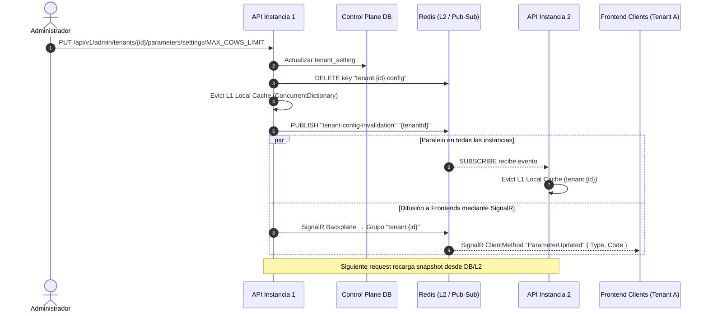
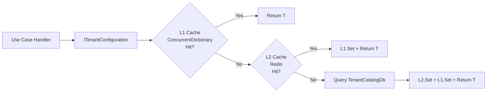
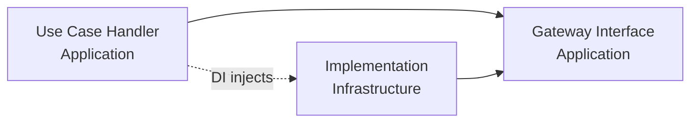

# Propuesta de Arquitectura: Sistema de Parametrización SaaS Multi-Tenant (T4 + Hybrid Cache + SignalR)

Esta propuesta detalla el diseño técnico para la implementación de un sistema de parametrización fuertemente tipado en **ZooTech**. Permite definir características (`features`), configuraciones (`setting_definitions`) y reglas de negocio (`rule_definitions`) en la base de datos de control plano (`TenantCatalogDb`), generar código estático mediante T4 y sincronizar los snapshots en memoria de múltiples instancias en tiempo real con Redis Pub/Sub y SignalR.

---

## 🏗️ 1. Arquitectura General y Flujo de Datos

Para soportar un entorno multi-instancia de alto rendimiento, se propone una **Caché Híbrida de Dos Niveles (L1/L2)** acoplada con un bus de invalidación por **Redis Pub/Sub** para la sincronización entre réplicas del backend y **SignalR** para clientes frontend.

### Diagrama de Sincronización y Caché (Multi-Instancia)



### Diagrama de Flujo de Lectura de Configuración (Casos de Uso)



---

## 🏛️ 2. Estructura de Carpetas Propuesta

Los nuevos componentes se integran dentro de la estructura de **Clean Architecture** respetando la regla de dependencias:

```text
ZooTech-Backend - Solution/
├── .config/
│   └── dotnet-tools.json                  ← NUEVO: Tool manifest para dotnet-t4
│
├── scripts/
│   └── watch-db-params.ps1                ← NUEVO: Watcher de BD en desarrollo
│
├── src/
│   ├── ZooTech.Domain/
│   │   ├── Parameters/                    ← NUEVO: Estructuras base tipadas
│   │   │   ├── SettingDefinition.cs       ← Definición genérica SettingDefinition<T>
│   │   │   ├── FeatureFlag.cs             ← Definición de feature flag
│   │   │   └── RuleSchema.cs              ← Definición de esquema de regla
│   │   └── Generated/                     ← NUEVO: Código generado por T4
│   │       └── ZooParameters.cs           ← [GENERADO] Clases estáticas de definición
│   │
│   ├── ZooTech.Application/
│   │   ├── Common/
│   │   │   └── Gateway/
│   │   │       ├── Configuration/         ← NUEVO: Puertos de acceso a configuración
│   │   │       │   ├── ITenantConfiguration.cs
│   │   │       │   ├── ITenantConfigurationRepository.cs
│   │   │       │   ├── ICacheInvalidationPublisher.cs
│   │   │       │   └── TenantConfigurationSnapshot.cs
│   │   │       └── SignalR/               ← NUEVO: Puerto de notificación SignalR
│   │   │           └── IParameterSyncNotifier.cs
│   │   └── Modules/
│   │       └── Module_Tenancing/
│   │           └── UseCases/
│   │               ├── GetTenantConfiguration/      ← NUEVO
│   │               ├── UpdateTenantParameter/        ← NUEVO
│   │               └── ResetTenantParameter/         ← NUEVO
│   │
│   ├── ZooTech.Infrastructure/
│   │   ├── Configuration/                 ← NUEVO: T4 Template
│   │   │   └── ZooParameters.tt
│   │   ├── Parameterization/              ← NUEVO: Implementaciones
│   │   │   ├── TenantConfigurationService.cs
│   │   │   ├── TenantConfigurationRepository.cs
│   │   │   ├── CacheInvalidationPublisher.cs
│   │   │   └── RedisSyncSubscriber.cs     ← IHostedService
│   │   └── Persistence/
│   │       ├── Context/
│   │       │   └── TenantCatalogDb.cs     ← MODIFICADO: Agregar DbSets faltantes
│   │       └── Entities/
│   │           └── MainTenantsDb/
│   │               └── tenant.cs          ← MODIFICADO: Agregar navegación tenant_settings
│   │
│   ├── ZooTech.InterfaceAdapters/
│   │   ├── Modules/
│   │   │   └── Module_Tenancing/          ← NUEVOS endpoints y DTOs
│   │   │       ├── Controllers/
│   │   │       │   └── TenantParametersController.cs
│   │   │       ├── DTOs/
│   │   │       │   ├── Requests/
│   │   │       │   └── Responses/
│   │   │       └── Mappers/
│   │   └── SignalR/                       ← NUEVO: Hub de SignalR
│   │       └── ParameterSyncHub.cs
│   │
│   └── ZooTech.API/
│       ├── Program.cs                     ← MODIFICADO: Registrar SignalR + nuevos servicios
│       └── appsettings.json               ← MODIFICADO: Agregar SignalR config
```

---

## 🚨 3. Correcciones Críticas vs. Documento Original

### ⛔ Violación de Clean Architecture en Handlers (CORREGIDO)

**Problema original:** Los handlers `GetTenantConfigurationQueryHandler`, `UpdateTenantParameterCommandHandler` y `ResetTenantParameterCommandHandler` referenciaban directamente `TenantCatalogDb` y `IConnectionMultiplexer` (StackExchange.Redis). Esto viola la regla de dependencias — Application NO puede depender de Infrastructure.

**Corrección:** Todos los handlers deben usar **interfaces de puerto (Gateway Ports)** definidas en `Application.Common.Gateway`:



### ⛔ `setting_definition` y `tenant_setting` NO están en TenantCatalogDb (CORREGIDO)

**Problema:** Las entidades `setting_definition.cs` y `tenant_setting.cs` existen como archivos en `Persistence/Entities/MainTenantsDb/` pero **NO tienen DbSet declarado** en `TenantCatalogDb.cs` y **NO tienen configuración Fluent API**. El documento original asumía que estaban completamente cableadas.

**Corrección:** Antes de implementar cualquier caso de uso, se deben:
1. Agregar `DbSet<setting_definition>` y `DbSet<tenant_setting>` en `TenantCatalogDb`
2. Agregar la configuración Fluent API correspondiente en `OnModelCreating`
3. Agregar la navegación `tenant_settings` en la entidad `tenant.cs`

### ⛔ Dualidad de sistemas de settings (ACLARADO)

El TenantCatalogDb contiene **DOS sistemas de configuración diferentes** que no deben confundirse:

| Sistema | Tablas | Propósito | Uso en esta feature |
|---|---|---|---|
| **Setting Definitions** | `setting_definition` + `tenant_setting` | Configuraciones tipadas con validación y valores por defecto globales | ✅ Usado para parametrización |
| **Business Settings** | `business_setting` + `business_setting_parameter` + `business_setting_parameter_value` | Configuración de negocio con patrón actor_type/actor_id (polimórfico) | ❌ No usado (sistema existente aparte) |

### ⛔ `GeneralResponseDTO<T>` es `internal` (CORREGIDO)

**Problema:** La clase `GeneralResponseDTO<T>` en `Application.Common.Models` está marcada como `internal`, lo que impide usarla desde `InterfaceAdapters` (ensamblado diferente).

**Corrección:** Cambiar a `public` o crear un DTO equivalente en InterfaceAdapters.

### ⛔ Controller inyecta Infrastructure directamente (CORREGIDO)

**Problema:** El `TenantSettingsAdminController` del governance doc inyectaba `TenantCatalogDb` e `IConnectionMultiplexer` directamente. Los controllers deben usar únicamente MediatR.

**Corrección:** Todo el CRUD de parámetros se maneja via `IMediator.Send(command/query)` y el controller solo recibe/retorna DTOs.

---

## 🏛️ 4. Especificación Detallada de Componentes

### A. Capa de Dominio (Domain) — Estructuras Tipadas

#### `SettingDefinition<T>` (Domain/Parameters/)

```csharp
namespace ZooTech.Domain.Parameters;

public class SettingDefinition<T>
{
    public string Code { get; }
    public string Category { get; }
    public T DefaultValue { get; }
    public string? Description { get; }
    public Type ValueType => typeof(T);

    public SettingDefinition(
        string code,
        string category,
        T defaultValue,
        string? description = null
    )
    {
        Code = code;
        Category = category;
        DefaultValue = defaultValue;
        Description = description;
    }
}
```

#### `FeatureFlag` (Domain/Parameters/)

```csharp
namespace ZooTech.Domain.Parameters;

public class FeatureFlag
{
    public string Code { get; }
    public string Category { get; }
    public bool DefaultValue { get; }
    public string? Description { get; }

    public FeatureFlag(
        string code,
        string category,
        bool defaultValue,
        string? description = null
    )
    {
        Code = code;
        Category = category;
        DefaultValue = defaultValue;
        Description = description;
    }
}
```

#### `RuleSchema` (Domain/Parameters/)

```csharp
namespace ZooTech.Domain.Parameters;

public class RuleSchema
{
    public string Code { get; }
    public string Module { get; }
    public string? ConditionSchema { get; }
    public string? ActionSchema { get; }

    public RuleSchema(
        string code,
        string module,
        string? conditionSchema = null,
        string? actionSchema = null
    )
    {
        Code = code;
        Module = module;
        ConditionSchema = conditionSchema;
        ActionSchema = actionSchema;
    }
}
```

#### Salida Generada por T4: `ZooParameters.cs`

Ejemplo de lo que el T4 debe generar basándose en la BD:

```csharp
namespace ZooTech.Domain.Generated;

using ZooTech.Domain.Parameters;

public static class ZooSettings
{
    public static class Billing
    {
        public static readonly SettingDefinition<int> MaxCowsLimit =
            new("MAX_COWS_LIMIT", "Billing", 100, "Límite de Vacunos Registrados");
        public static readonly SettingDefinition<int> MaxVeterinariansLimit =
            new("MAX_VETERINARIANS_LIMIT", "Billing", 5, "Límite Máximo de Veterinarios Activos");
    }

    public static class General
    {
        public static readonly SettingDefinition<string> CompanyName =
            new("COMPANY_NAME", "General", "ZooTech", "Nombre de la empresa");
    }
}

public static class ZooFeatures
{
    public static class Production
    {
        public static readonly FeatureFlag MilkAnalysis =
            new("PROD_MILK_ANALYSIS", "Production", true, "Módulo de Análisis Avanzado de Calidad de Leche");
    }
}

public static class ZooRules
{
    public static class Health
    {
        public static readonly RuleSchema RemindVaccination =
            new("REMIND_VACCINATION", "Health");
    }
}
```

### B. Capa de Aplicación (Application) — Puertos y Casos de Uso

#### Puerto: `ITenantConfiguration` (Gateway/Configuration/)

Interfaz principal que los casos de uso consumen para leer configuraciones tipadas:

```csharp
namespace ZooTech.Application.Common.Gateway.Configuration;

using ZooTech.Domain.Parameters;

public interface ITenantConfiguration
{
    T Get<T>(SettingDefinition<T> setting);
    bool IsEnabled(FeatureFlag feature);
    string? GetRaw(string code);
}
```

#### Puerto: `ITenantConfigurationRepository` (Gateway/Configuration/)

Repositorio abstracto para operaciones CRUD sobre la configuración del tenant:

```csharp
namespace ZooTech.Application.Common.Gateway.Configuration;

public interface ITenantConfigurationRepository
{
    Task<TenantConfigurationSnapshot> GetSnapshotAsync(long tenantId);
    Task<bool> UpsertSettingAsync(long tenantId, string settingCode, string value);
    Task<bool> UpsertFeatureAsync(long tenantId, string featureCode, bool isEnabled);
    Task<bool> DeleteTenantSettingAsync(long tenantId, string settingCode);
    Task<bool> DeleteTenantFeatureAsync(long tenantId, string featureCode);
}
```

#### Puerto: `ICacheInvalidationPublisher` (Gateway/Configuration/)

Puerto para la invalidación de caché (L2 + Pub/Sub + SignalR):

```csharp
namespace ZooTech.Application.Common.Gateway.Configuration;

public interface ICacheInvalidationPublisher
{
    Task InvalidateTenantConfigAsync(long tenantId, string parameterType, string code);
}
```

#### Puerto: `IParameterSyncNotifier` (Gateway/SignalR/)

Puerto para notificar a clientes frontend via SignalR:

```csharp
namespace ZooTech.Application.Common.Gateway.SignalR;

public interface IParameterSyncNotifier
{
    Task NotifyParameterUpdatedAsync(long tenantId, string parameterType, string code);
}
```

#### Modelo: `TenantConfigurationSnapshot` (Gateway/Configuration/)

Snapshot de la configuración completa de un tenant:

```csharp
namespace ZooTech.Application.Common.Gateway.Configuration;

public class TenantConfigurationSnapshot
{
    public long TenantId { get; set; }
    public Dictionary<string, string> Settings { get; set; } = new();
    public Dictionary<string, bool> Features { get; set; } = new();
    public DateTimeOffset LoadedAt { get; set; } = DateTimeOffset.UtcNow;
}
```

#### Enum: `ParameterType`

Reemplaza el uso de strings "Setting"/"Feature" en los comandos:

```csharp
namespace ZooTech.Application.Modules.Module_Tenancing.UseCases;

public enum ParameterType
{
    Setting,
    Feature
}
```

#### Caso de Uso: `GetTenantConfiguration`

```
GetTenantConfiguration/
├── GetTenantConfigurationQuery.cs       ← IRequest<TenantConfigurationDto>
├── GetTenantConfigurationHandler.cs     ← IRequestHandler (usa ITenantConfigurationRepository)
├── GetTenantConfigurationValidator.cs   ← AbstractValidator
└── GetTenantConfigurationDto.cs         ← DTOs de salida
```

**Query:**
```csharp
namespace ZooTech.Application.Modules.Module_Tenancing.UseCases.GetTenantConfiguration;

using MediatR;

public record GetTenantConfigurationQuery(long TenantId) : IRequest<GetTenantConfigurationDto>;
```

**DTOs:**
```csharp
namespace ZooTech.Application.Modules.Module_Tenancing.UseCases.GetTenantConfiguration;

public record GetTenantConfigurationDto(
    long TenantId,
    List<SettingItemDto> Settings,
    List<FeatureItemDto> Features
);

public record SettingItemDto(
    string Code,
    string Name,
    string Category,
    string DataType,
    string Value,
    string DefaultValue,
    bool IsCustomized,
    string? ValidationSchema
);

public record FeatureItemDto(
    string Code,
    string Name,
    string Category,
    bool IsEnabled,
    bool DefaultValue,
    bool IsCustomized
);
```

**Handler:**
```csharp
namespace ZooTech.Application.Modules.Module_Tenancing.UseCases.GetTenantConfiguration;

using MediatR;
using ZooTech.Application.Common.Gateway.Configuration;

public class GetTenantConfigurationHandler
    : IRequestHandler<GetTenantConfigurationQuery, GetTenantConfigurationDto>
{
    private readonly ITenantConfigurationRepository _repository;

    public GetTenantConfigurationHandler(ITenantConfigurationRepository repository)
    {
        _repository = repository;
    }

    public async Task<GetTenantConfigurationDto> Handle(
        GetTenantConfigurationQuery request,
        CancellationToken cancellationToken
    )
    {
        var snapshot = await _repository.GetSnapshotAsync(request.TenantId);
        // El handler construye el DTO cruzando definiciones globales con valores del tenant
        // La lógica de merge se implementa en el repositorio o aquí
        return snapshot.ToDto();
    }
}
```

**Validator:**
```csharp
namespace ZooTech.Application.Modules.Module_Tenancing.UseCases.GetTenantConfiguration;

using FluentValidation;

public class GetTenantConfigurationValidator : AbstractValidator<GetTenantConfigurationQuery>
{
    public GetTenantConfigurationValidator()
    {
        RuleFor(x => x.TenantId)
            .GreaterThan(0).WithMessage("El ID del tenant debe ser mayor a 0.");
    }
}
```

#### Caso de Uso: `UpdateTenantParameter`

```
UpdateTenantParameter/
├── UpdateTenantParameterCommand.cs
├── UpdateTenantParameterHandler.cs
└── UpdateTenantParameterValidator.cs
```

**Command:**
```csharp
namespace ZooTech.Application.Modules.Module_Tenancing.UseCases.UpdateTenantParameter;

using MediatR;
using ZooTech.Application.Modules.Module_Tenancing.UseCases;

public record UpdateTenantParameterCommand(
    long TenantId,
    ParameterType ParameterType,
    string Code,
    string Value
) : IRequest<bool>;
```

**Handler:**
```csharp
namespace ZooTech.Application.Modules.Module_Tenancing.UseCases.UpdateTenantParameter;

using MediatR;
using ZooTech.Application.Common.Gateway.Configuration;

public class UpdateTenantParameterHandler
    : IRequestHandler<UpdateTenantParameterCommand, bool>
{
    private readonly ITenantConfigurationRepository _repository;
    private readonly ICacheInvalidationPublisher _cachePublisher;
    private readonly IParameterSyncNotifier _signalRNotifier;

    public UpdateTenantParameterHandler(
        ITenantConfigurationRepository repository,
        ICacheInvalidationPublisher cachePublisher,
        IParameterSyncNotifier signalRNotifier
    )
    {
        _repository = repository;
        _cachePublisher = cachePublisher;
        _signalRNotifier = signalRNotifier;
    }

    public async Task<bool> Handle(
        UpdateTenantParameterCommand request,
        CancellationToken cancellationToken
    )
    {
        bool result = request.ParameterType switch
        {
            ParameterType.Setting => await _repository.UpsertSettingAsync(
                request.TenantId, request.Code, request.Value),
            ParameterType.Feature => await _repository.UpsertFeatureAsync(
                request.TenantId, request.Code, bool.Parse(request.Value)),
            _ => false
        };

        if (result)
        {
            await _cachePublisher.InvalidateTenantConfigAsync(
                request.TenantId,
                request.ParameterType.ToString(),
                request.Code
            );

            await _signalRNotifier.NotifyParameterUpdatedAsync(
                request.TenantId,
                request.ParameterType.ToString(),
                request.Code
            );
        }

        return result;
    }
}
```

**Validator:**
```csharp
namespace ZooTech.Application.Modules.Module_Tenancing.UseCases.UpdateTenantParameter;

using FluentValidation;

public class UpdateTenantParameterValidator : AbstractValidator<UpdateTenantParameterCommand>
{
    public UpdateTenantParameterValidator()
    {
        RuleFor(x => x.TenantId)
            .GreaterThan(0).WithMessage("El ID del tenant debe ser mayor a 0.");

        RuleFor(x => x.ParameterType)
            .IsInEnum().WithMessage("Tipo de parámetro inválido.");

        RuleFor(x => x.Code)
            .NotEmpty().WithMessage("El código del parámetro es requerido.")
            .MaximumLength(100).WithMessage("El código no puede exceder 100 caracteres.");

        RuleFor(x => x.Value)
            .NotNull().WithMessage("El valor no puede ser nulo.");
    }
}
```

#### Caso de Uso: `ResetTenantParameter`

```
ResetTenantParameter/
├── ResetTenantParameterCommand.cs
├── ResetTenantParameterHandler.cs
└── ResetTenantParameterValidator.cs
```

**Command:**
```csharp
namespace ZooTech.Application.Modules.Module_Tenancing.UseCases.ResetTenantParameter;

using MediatR;
using ZooTech.Application.Modules.Module_Tenancing.UseCases;

public record ResetTenantParameterCommand(
    long TenantId,
    ParameterType ParameterType,
    string Code
) : IRequest<bool>;
```

**Handler:**
```csharp
namespace ZooTech.Application.Modules.Module_Tenancing.UseCases.ResetTenantParameter;

using MediatR;
using ZooTech.Application.Common.Gateway.Configuration;

public class ResetTenantParameterHandler
    : IRequestHandler<ResetTenantParameterCommand, bool>
{
    private readonly ITenantConfigurationRepository _repository;
    private readonly ICacheInvalidationPublisher _cachePublisher;
    private readonly IParameterSyncNotifier _signalRNotifier;

    public ResetTenantParameterHandler(
        ITenantConfigurationRepository repository,
        ICacheInvalidationPublisher cachePublisher,
        IParameterSyncNotifier signalRNotifier
    )
    {
        _repository = repository;
        _cachePublisher = cachePublisher;
        _signalRNotifier = signalRNotifier;
    }

    public async Task<bool> Handle(
        ResetTenantParameterCommand request,
        CancellationToken cancellationToken
    )
    {
        bool result = request.ParameterType switch
        {
            ParameterType.Setting => await _repository.DeleteTenantSettingAsync(
                request.TenantId, request.Code),
            ParameterType.Feature => await _repository.DeleteTenantFeatureAsync(
                request.TenantId, request.Code),
            _ => false
        };

        if (result)
        {
            await _cachePublisher.InvalidateTenantConfigAsync(
                request.TenantId,
                request.ParameterType.ToString(),
                request.Code
            );

            await _signalRNotifier.NotifyParameterUpdatedAsync(
                request.TenantId,
                request.ParameterType.ToString(),
                request.Code
            );
        }

        return result;
    }
}
```

**Validator:**
```csharp
namespace ZooTech.Application.Modules.Module_Tenancing.UseCases.ResetTenantParameter;

using FluentValidation;

public class ResetTenantParameterValidator : AbstractValidator<ResetTenantParameterCommand>
{
    public ResetTenantParameterValidator()
    {
        RuleFor(x => x.TenantId)
            .GreaterThan(0).WithMessage("El ID del tenant debe ser mayor a 0.");

        RuleFor(x => x.ParameterType)
            .IsInEnum().WithMessage("Tipo de parámetro inválido.");

        RuleFor(x => x.Code)
            .NotEmpty().WithMessage("El código del parámetro es requerido.")
            .MaximumLength(100).WithMessage("El código no puede exceder 100 caracteres.");
    }
}
```

### C. Capa de Infraestructura (Infrastructure) — Implementaciones

#### `TenantConfigurationService` (Parameterization/)

Implementa `ITenantConfiguration` con caché híbrida L1/L2:

```csharp
namespace ZooTech.Infrastructure.Parameterization;

using System.Collections.Concurrent;
using System.Text.Json;
using ZooTech.Application.Common.Gateway.Configuration;
using ZooTech.Application.Common.Gateway.Context;
using ZooTech.Domain.Parameters;
using StackExchange.Redis;

public class TenantConfigurationService : ITenantConfiguration
{
    private readonly ITenantContext _tenantContext;
    private readonly ITenantConfigurationRepository _repository;
    private readonly IConnectionMultiplexer _redis;

    private static readonly ConcurrentDictionary<long, TenantConfigurationSnapshot> L1Cache = new();

    public TenantConfigurationService(
        ITenantContext tenantContext,
        ITenantConfigurationRepository repository,
        IConnectionMultiplexer redis
    )
    {
        _tenantContext = tenantContext;
        _repository = repository;
        _redis = redis;
    }

    public T Get<T>(SettingDefinition<T> setting)
    {
        var snapshot = GetOrLoadSnapshot();

        if (snapshot.Settings.TryGetValue(setting.Code, out var rawValue))
        {
            return ConvertValue<T>(rawValue, setting.DefaultValue);
        }

        return setting.DefaultValue;
    }

    public bool IsEnabled(FeatureFlag feature)
    {
        var snapshot = GetOrLoadSnapshot();

        if (snapshot.Features.TryGetValue(feature.Code, out var isEnabled))
        {
            return isEnabled;
        }

        return feature.DefaultValue;
    }

    public string? GetRaw(string code)
    {
        var snapshot = GetOrLoadSnapshot();

        return snapshot.Settings.TryGetValue(code, out var value) ? value : null;
    }

    public static void EvictL1(long tenantId)
    {
        L1Cache.TryRemove(tenantId, out _);
    }

    private TenantConfigurationSnapshot GetOrLoadSnapshot()
    {
        var tenantId = _tenantContext.TenantId;

        if (L1Cache.TryGetValue(tenantId, out var cached))
            return cached;

        var redisDb = _redis.GetDatabase();
        var redisKey = $"tenant:{tenantId}:config";
        var redisValue = redisDb.StringGet(redisKey);

        if (redisValue.HasValue)
        {
            var snapshot = JsonSerializer.Deserialize<TenantConfigurationSnapshot>(redisValue!);
            if (snapshot is not null)
            {
                L1Cache[tenantId] = snapshot;
                return snapshot;
            }
        }

        var loaded = _repository.GetSnapshotAsync(tenantId).GetAwaiter().GetResult();
        L1Cache[tenantId] = loaded;

        var serialized = JsonSerializer.Serialize(loaded);
        redisDb.StringSet(redisKey, serialized, TimeSpan.FromMinutes(10));

        return loaded;
    }

    private static T ConvertValue<T>(string rawValue, T fallback)
    {
        try
        {
            return (T)Convert.ChangeType(rawValue, typeof(T));
        }
        catch
        {
            return fallback;
        }
    }
}
```

#### `TenantConfigurationRepository` (Parameterization/)

Implementa `ITenantConfigurationRepository` usando `TenantCatalogDb`:

```csharp
namespace ZooTech.Infrastructure.Parameterization;

using Microsoft.EntityFrameworkCore;
using ZooTech.Application.Common.Gateway.Configuration;
using ZooTech.Infrastructure.Persistence.Context;

public class TenantConfigurationRepository : ITenantConfigurationRepository
{
    private readonly TenantCatalogDb _context;

    public TenantConfigurationRepository(TenantCatalogDb context)
    {
        _context = context;
    }

    public async Task<TenantConfigurationSnapshot> GetSnapshotAsync(long tenantId)
    {
        var globalSettings = await _context.setting_definitions
            .AsNoTracking()
            .ToListAsync();

        var tenantSettings = await _context.tenant_settings
            .AsNoTracking()
            .Where(ts => ts.tenant_id == tenantId)
            .ToDictionaryAsync(ts => ts.setting_definition_id, ts => ts.value ?? "");

        var globalFeatures = await _context.features
            .AsNoTracking()
            .Where(f => f.deleted_at == null)
            .ToListAsync();

        var tenantFeatures = await _context.tenant_features
            .AsNoTracking()
            .Where(tf => tf.tenant_id == tenantId)
            .ToDictionaryAsync(tf => tf.feature_id, tf => tf.is_enabled);

        var settings = new Dictionary<string, string>();
        foreach (var def in globalSettings)
        {
            if (def.code is null) continue;
            var value = tenantSettings.TryGetValue(def.id, out var custom)
                ? custom
                : def.default_value ?? "";
            settings[def.code] = value;
        }

        var features = new Dictionary<string, bool>();
        foreach (var feat in globalFeatures)
        {
            var isEnabled = tenantFeatures.TryGetValue(feat.id, out var custom)
                ? custom
                : feat.is_active;
            features[feat.code] = isEnabled;
        }

        return new TenantConfigurationSnapshot
        {
            TenantId = tenantId,
            Settings = settings,
            Features = features,
            LoadedAt = DateTimeOffset.UtcNow
        };
    }

    public async Task<bool> UpsertSettingAsync(long tenantId, string settingCode, string value)
    {
        var definition = await _context.setting_definitions
            .FirstOrDefaultAsync(sd => sd.code == settingCode);

        if (definition is null) return false;

        var existing = await _context.tenant_settings
            .FirstOrDefaultAsync(ts => ts.tenant_id == tenantId
                && ts.setting_definition_id == definition.id);

        if (existing is null)
        {
            _context.tenant_settings.Add(new()
            {
                tenant_id = tenantId,
                setting_definition_id = definition.id,
                value = value,
                updated_at = DateTimeOffset.UtcNow
            });
        }
        else
        {
            existing.value = value;
            existing.updated_at = DateTimeOffset.UtcNow;
        }

        await _context.SaveChangesAsync();
        return true;
    }

    public async Task<bool> UpsertFeatureAsync(long tenantId, string featureCode, bool isEnabled)
    {
        var feature = await _context.features
            .FirstOrDefaultAsync(f => f.code == featureCode && f.deleted_at == null);

        if (feature is null) return false;

        var existing = await _context.tenant_features
            .FirstOrDefaultAsync(tf => tf.tenant_id == tenantId
                && tf.feature_id == feature.id);

        if (existing is null)
        {
            _context.tenant_features.Add(new()
            {
                tenant_id = tenantId,
                feature_id = feature.id,
                is_enabled = isEnabled,
                enabled_at = DateTime.UtcNow,
                updated_at = DateTime.UtcNow
            });
        }
        else
        {
            existing.is_enabled = isEnabled;
            existing.updated_at = DateTime.UtcNow;
        }

        await _context.SaveChangesAsync();
        return true;
    }

    public async Task<bool> DeleteTenantSettingAsync(long tenantId, string settingCode)
    {
        var definition = await _context.setting_definitions
            .FirstOrDefaultAsync(sd => sd.code == settingCode);

        if (definition is null) return false;

        var existing = await _context.tenant_settings
            .FirstOrDefaultAsync(ts => ts.tenant_id == tenantId
                && ts.setting_definition_id == definition.id);

        if (existing is null) return false;

        _context.tenant_settings.Remove(existing);
        await _context.SaveChangesAsync();
        return true;
    }

    public async Task<bool> DeleteTenantFeatureAsync(long tenantId, string featureCode)
    {
        var feature = await _context.features
            .FirstOrDefaultAsync(f => f.code == featureCode && f.deleted_at == null);

        if (feature is null) return false;

        var existing = await _context.tenant_features
            .FirstOrDefaultAsync(tf => tf.tenant_id == tenantId
                && tf.feature_id == feature.id);

        if (existing is null) return false;

        _context.tenant_features.Remove(existing);
        await _context.SaveChangesAsync();
        return true;
    }
}
```

#### `CacheInvalidationPublisher` (Parameterization/)

Implementa `ICacheInvalidationPublisher`:

```csharp
namespace ZooTech.Infrastructure.Parameterization;

using StackExchange.Redis;
using ZooTech.Application.Common.Gateway.Configuration;

public class CacheInvalidationPublisher : ICacheInvalidationPublisher
{
    private readonly IConnectionMultiplexer _redis;

    public CacheInvalidationPublisher(IConnectionMultiplexer redis)
    {
        _redis = redis;
    }

    public async Task InvalidateTenantConfigAsync(
        long tenantId,
        string parameterType,
        string code
    )
    {
        var db = _redis.GetDatabase();
        var cacheKey = $"tenant:{tenantId}:config";

        await db.KeyDeleteAsync(cacheKey);

        TenantConfigurationService.EvictL1(tenantId);

        var subscriber = _redis.GetSubscriber();
        await subscriber.PublishAsync(
            new RedisChannel("tenant-config-invalidation", RedisChannel.PatternMode.Literal),
            tenantId.ToString()
        );
    }
}
```

#### `RedisSyncSubscriber` (Parameterization/) — IHostedService

```csharp
namespace ZooTech.Infrastructure.Parameterization;

using Microsoft.Extensions.Hosting;
using StackExchange.Redis;

public class RedisSyncSubscriber : BackgroundService
{
    private readonly IConnectionMultiplexer _redis;

    public RedisSyncSubscriber(IConnectionMultiplexer redis)
    {
        _redis = redis;
    }

    protected override Task ExecuteAsync(CancellationToken stoppingToken)
    {
        var subscriber = _redis.GetSubscriber();

        subscriber.Subscribe(
            new RedisChannel("tenant-config-invalidation", RedisChannel.PatternMode.Literal),
            (channel, message) =>
            {
                if (long.TryParse(message, out var tenantId))
                {
                    TenantConfigurationService.EvictL1(tenantId);
                }
            }
        );

        return Task.CompletedTask;
    }

    public override Task StopAsync(CancellationToken cancellationToken)
    {
        _redis.GetSubscriber().UnsubscribeAll();
        return base.StopAsync(cancellationToken);
    }
}
```

#### `SignalRNotifier` (Parameterization/)

Implementa `IParameterSyncNotifier`:

```csharp
namespace ZooTech.Infrastructure.Parameterization;

using Microsoft.AspNetCore.SignalR;
using ZooTech.Application.Common.Gateway.SignalR;
using ZooTech.InterfaceAdapters.SignalR;

public class SignalRNotifier : IParameterSyncNotifier
{
    private readonly IHubContext<ParameterSyncHub> _hubContext;

    public SignalRNotifier(IHubContext<ParameterSyncHub> hubContext)
    {
        _hubContext = hubContext;
    }

    public async Task NotifyParameterUpdatedAsync(
        long tenantId,
        string parameterType,
        string code
    )
    {
        await _hubContext.Clients
            .Group($"tenant:{tenantId}")
            .SendAsync("ParameterUpdated", new
            {
                Type = parameterType,
                Code = code,
                UpdatedAt = DateTimeOffset.UtcNow
            });
    }
}
```

> **⚠️ Nota arquitectónica:** `SignalRNotifier` reside en Infrastructure pero necesita referenciar `ParameterSyncHub` de InterfaceAdapters, creando una dependencia circular. Para resolver esto, se debe definir `IParameterSyncNotifier` en Application (como puerto) y la implementación puede vivir en InterfaceAdapters (ya que `IHubContext<T>` es de ASP.NET Core), o bien mover el Hub a Infrastructure. La opción recomendada es: **mover `ParameterSyncHub` a Infrastructure** para evitar la dependencia circular, ya que InterfaceAdapters ya depende de Application pero Infrastructure NO depende de InterfaceAdapters.

**Solución recomendada:** Colocar `ParameterSyncHub` en `Infrastructure/SignalR/` y `SignalRNotifier` también en `Infrastructure/Parameterization/`.

### D. SignalR Hub (Infrastructure/SignalR/)

```csharp
namespace ZooTech.Infrastructure.SignalR;

using Microsoft.AspNetCore.SignalR;

public class ParameterSyncHub : Hub
{
    public override async Task OnConnectedAsync()
    {
        var tenantId = Context.GetHttpContext()?.Request.Query["tenantId"].ToString();

        if (!string.IsNullOrEmpty(tenantId))
        {
            await Groups.AddToGroupAsync(Context.ConnectionId, $"tenant:{tenantId}");
        }

        await base.OnConnectedAsync();
    }

    public override async Task OnDisconnectedAsync(Exception? exception)
    {
        var tenantId = Context.GetHttpContext()?.Request.Query["tenantId"].ToString();

        if (!string.IsNullOrEmpty(tenantId))
        {
            await Groups.RemoveFromGroupAsync(Context.ConnectionId, $"tenant:{tenantId}");
        }

        await base.OnDisconnectedAsync(exception);
    }
}
```

### E. InterfaceAdapters — Controller y DTOs

#### `TenantParametersController`

```csharp
namespace ZooTech.InterfaceAdapters.Modules.Module_Tenancing.Controllers;

using MediatR;
using Microsoft.AspNetCore.Mvc;
using ZooTech.Application.Modules.Module_Tenancing.UseCases;
using ZooTech.Application.Modules.Module_Tenancing.UseCases.GetTenantConfiguration;
using ZooTech.Application.Modules.Module_Tenancing.UseCases.UpdateTenantParameter;
using ZooTech.Application.Modules.Module_Tenancing.UseCases.ResetTenantParameter;

[ApiController]
[Route("api/v1/admin/tenants/{tenantId}/parameters")]
public class TenantParametersController : ControllerBase
{
    private readonly IMediator _mediator;

    public TenantParametersController(IMediator mediator)
    {
        _mediator = mediator;
    }

    [HttpGet]
    public async Task<IActionResult> GetConfig(long tenantId)
    {
        var result = await _mediator.Send(new GetTenantConfigurationQuery(tenantId));
        return Ok(new { success = true, data = result });
    }

    [HttpPut("{paramType}/{code}")]
    public async Task<IActionResult> UpdateConfig(
        long tenantId,
        string paramType,
        string code,
        [FromBody] UpdateParameterRequestDto request
    )
    {
        if (!Enum.TryParse<ParameterType>(paramType, true, out var type))
            return BadRequest(new { success = false, error = "Tipo de parámetro inválido. Use 'Setting' o 'Feature'." });

        var result = await _mediator.Send(new UpdateTenantParameterCommand(tenantId, type, code, request.Value));

        if (!result)
            return NotFound(new { success = false, error = "Parámetro no encontrado." });

        return Ok(new { success = true, message = "Parámetro actualizado y propagado." });
    }

    [HttpDelete("{paramType}/{code}")]
    public async Task<IActionResult> ResetConfig(long tenantId, string paramType, string code)
    {
        if (!Enum.TryParse<ParameterType>(paramType, true, out var type))
            return BadRequest(new { success = false, error = "Tipo de parámetro inválido. Use 'Setting' o 'Feature'." });

        var result = await _mediator.Send(new ResetTenantParameterCommand(tenantId, type, code));

        if (!result)
            return NotFound(new { success = false, error = "Configuración personalizada no encontrada." });

        return Ok(new { success = true, message = "Configuración restablecida al valor global." });
    }
}
```

#### DTO de Request

```csharp
namespace ZooTech.InterfaceAdapters.Modules.Module_Tenancing.DTOs.Requests;

public record UpdateParameterRequestDto(string Value);
```

---

## ⚡ 5. T4 Template — `ZooParameters.tt`

### Ubicación
`src/ZooTech.Infrastructure/Configuration/ZooParameters.tt`

### Pre-requisitos
1. Instalar herramienta: `dotnet tool install dotnet-t4`
2. Crear manifest: `.config/dotnet-tools.json`

```json
{
  "version": 1,
  "isRoot": true,
  "tools": {
    "dotnet-t4": {
      "version": "3.0.0",
      "commands": ["t4"]
    }
  }
}
```

### Comando de generación manual

```powershell
dotnet t4 src/ZooTech.Infrastructure/Configuration/ZooParameters.tt -o src/ZooTech.Domain/Generated/ZooParameters.cs
```

### MSBuild Target (agregar a `ZooTech.Infrastructure.csproj`)

```xml
<Target Name="GenerateZooParameters" BeforeTargets="BeforeBuild">
  <Message Importance="High" Text="[T4] Regenerando parámetros de dominio desde BD..." />
  <Exec Command="dotnet t4 &quot;$(ProjectDir)Configuration\ZooParameters.tt&quot; -o &quot;$(SolutionDir)src\ZooTech.Domain\Generated\ZooParameters.cs&quot;" />
</Target>
```

### Esquema del T4 (pseudo-código)

El archivo `.tt` debe:
1. Conectarse a la BD de control plano via ADO.NET directo (`Microsoft.Data.SqlClient`)
2. Consultar `setting_definitions` (code, name, category, data_type, default_value)
3. Consultar `features` (code, name, category, is_active) donde `deleted_at IS NULL`
4. Consultar `rule_definitions` (code, name, module, condition_schema, action_schema)
5. Agrupar settings por `category`
6. Generar clases estáticas anidadas:
   - `ZooSettings.{Category}.{PascalName} = new SettingDefinition<{MappedType}>(...)`
   - `ZooFeatures.{Category}.{PascalName} = new FeatureFlag(...)`
   - `ZooRules.{Module}.{PascalName} = new RuleSchema(...)`
7. Mapeo de data_type a C#: `INT` → `int`, `BOOLEAN` → `bool`, `DECIMAL` → `decimal`, `STRING` → `string`, `DATETIME` → `string`

---

## 📋 6. Registro de Dependency Injection

### `ZooTech.Application/DependencyInjection.cs` — Sin cambios
Los puertos no se registran en Application.

### `ZooTech.Infrastructure/DependencyInjection.cs` — Agregar

```csharp
// Configuration
services.AddScoped<ITenantConfiguration, TenantConfigurationService>();
services.AddScoped<ITenantConfigurationRepository, TenantConfigurationRepository>();
services.AddScoped<ICacheInvalidationPublisher, CacheInvalidationPublisher>();
services.AddScoped<IParameterSyncNotifier, SignalRNotifier>();

// Background Services
services.AddHostedService<RedisSyncSubscriber>();
```

### `ZooTech.API/Program.cs` — Agregar

```csharp
// SignalR
builder.Services.AddSignalR()
    .AddStackExchangeRedis(config["Redis:ConnectionString"] ?? "");

// Hub endpoint
app.MapHub<ParameterSyncHub>("/hubs/parameters");

// CORS update (agregar SignalR)
policy.AllowCredentials();
```

### Paquetes NuGet a agregar

| Paquete | Proyecto |
|---|---|
| `Microsoft.AspNetCore.SignalR.StackExchangeRedis` | `ZooTech.API` |
| `dotnet-t4` (tool) | Solution root (`.config/dotnet-tools.json`) |

---

## 🔄 7. Modificaciones a Archivos Existentes

### `TenantCatalogDb.cs` — Agregar DbSets

```csharp
public virtual DbSet<setting_definition> setting_definitions { get; set; }
public virtual DbSet<tenant_setting> tenant_settings { get; set; }
```

### `tenant.cs` — Agregar navegación

```csharp
[InverseProperty("tenant")]
public virtual ICollection<tenant_setting> tenant_settings { get; set; } = new List<tenant_setting>();
```

### `GeneralResponseDTO<T>` — Cambiar visibilidad

Cambiar de `internal` a `public` en `Application/Common/Models/GeneralResponseDTO.cs`.

### `appsettings.json` — Sin cambios estructurales
Las keys de Redis ya existen. No se requieren nuevas keys.
