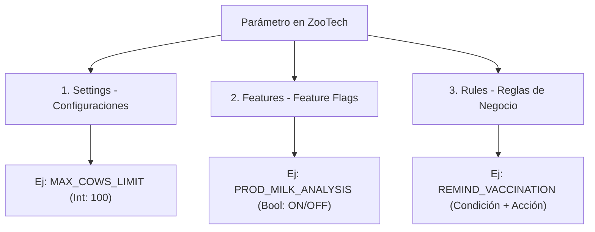
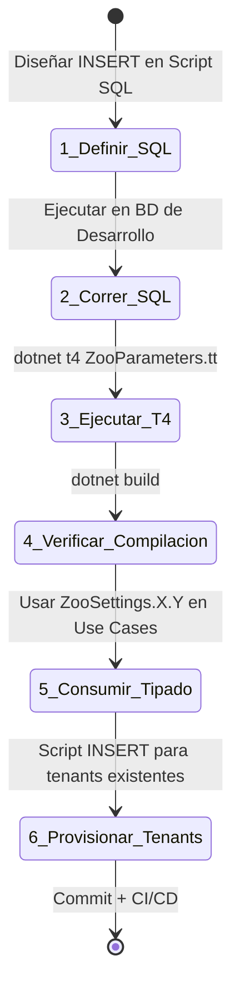

# Playbook de Gobernanza: Creación y Manejo de Parámetros (Settings, Features y Rules)

Este documento establece la estrategia, convenciones y contratos prácticos de desarrollo en **ZooTech** para asegurar que todo el equipo (Frontend, Backend, DBA y DevOps) esté coordinado al crear, modificar o eliminar parámetros globales o específicos de tenants.

---

## 📖 1. Glosario de Términos y Taxonomía

Para evitar confusiones en el equipo, definimos los límites conceptuales de cada elemento:



| Tipo | ¿Qué es? | Tipo de Dato | Mutabilidad en Ejecución | Ejemplo Práctico |
| :--- | :--- | :--- | :--- | :--- |
| **Settings** | Valores de control que modifican el *comportamiento* de una funcionalidad existente. | Fuertemente tipado (int, string, bool, decimal). | Alta (Editado por Admin via API). | `MAX_COWS_LIMIT` |
| **Features** | Interruptores binarios (ON/OFF) que activan o desactivan *módulos completos* (por suscripción o despliegue progresivo). | Booleano implícito. | Baja (Normalmente atado a planes de pago). | `PROD_MILK_ANALYSIS` |
| **Rules** | Lógica estructurada dinámica (esquemas JSON de condiciones y acciones) que orquesta decisiones de negocio. | Objeto complejo (JSON). | Media (Personalizado por tenant). | `REMIND_VACCINATION` |

---

## 🗄️ 2. Esquema Real de Base de Datos (Tablas Involucradas)

### Sistema de Setting Definitions (usado en esta feature)

```
setting_definition                      tenant_setting
├── id (long, PK)                       ├── tenant_id (long, PK, FK→tenant)
├── code (string?, nvarchar 100)        ├── setting_definition_id (long, PK, FK→setting_definition)
├── name (string?, nvarchar 150)        ├── value (string?)
├── category (string?, nvarchar 100)    ├── metadata (string?)
├── data_type (string?, nvarchar 30)    └── updated_at (DateTimeOffset?, Precision 3)
├── default_value (string?)
├── validation_schema (string?)
├── is_required (bool?)
├── is_sensitive (bool?)
├── metadata (string?)
├── created_at (DateTimeOffset?, Precision 3)
└── updated_at (DateTimeOffset?, Precision 3)
```

### Sistema de Features (ya cableado en DbContext)

```
feature                                 tenant_feature
├── id (long, PK)                       ├── tenant_id (long, PK, FK→tenant)
├── code (string, varchar 100, UNIQUE)  ├── feature_id (long, PK, FK→feature)
├── name (string, varchar 150)          ├── is_enabled (bool)
├── description (string?)               ├── enabled_at (DateTime?)
├── category (string?, varchar 100)     ├── expires_at (DateTime?)
├── is_active (bool)                    ├── metadata (string?)
├── metadata (string?)                  └── updated_at (DateTime?)
├── created_at (DateTime)
├── updated_at (DateTime?)
└── deleted_at (DateTime?)
```

### Sistema de Rules (ya cableado en DbContext)

```
rule_definition                         tenant_business_rule
├── id (long, PK)                       ├── tenant_id (long, PK, FK→tenant)
├── code (string?, varchar 100)         ├── rule_definition_id (long, PK, FK→rule_definition)
├── name (string?, varchar 150)         ├── is_active (bool)
├── module (string?, varchar 100)       ├── priority (int?)
├── condition_schema (string?)          ├── rule_version (int?)
├── action_schema (string?)             ├── execution_mode (string?, varchar 50)
├── metadata (string?)                  ├── custom_condition (string?)
├── created_at (DateTime)               ├── custom_action (string?)
└── updated_at (DateTime?)              ├── metadata (string?)
                                        └── updated_at (DateTime?)
```

### ⚠️ Sistema Business Settings (NO usar para esta feature)

Existe un sistema paralelo **NO relacionado** con la parametrización:
```
business_setting → business_setting_parameter → business_setting_parameter_value
```
Este sistema usa un patrón polimórfico (`actor_type` + `actor_id`) y está diseñado para otro propósito. **No se modifica ni se utiliza en esta implementación.**

---

## 🛠️ 3. Flujo de Trabajo para Desarrolladores (Paso a Paso)

Cuando un desarrollador necesita agregar un nuevo parámetro, debe seguir estrictamente este flujo:



### Paso 1: Diseñar e Insertar la Definición Global (SQL)

Toda definición nace en la base de datos de control plano (`TenantCatalogDb`).

### Paso 2: Ejecutar en BD de Desarrollo

Ejecutar el script SQL directamente contra la BD del catálogo plano en ambiente de desarrollo.

### Paso 3: Ejecutar el T4

```powershell
dotnet t4 src/ZooTech.Infrastructure/Configuration/ZooParameters.tt -o src/ZooTech.Domain/Generated/ZooParameters.cs
```

Esto regenera `ZooParameters.cs` en la capa de Dominio.

### Paso 4: Verificar Compilación

```powershell
dotnet build
```

Confirmar que el código generado compila correctamente y que las nuevas constantes están disponibles con autocompletado.

### Paso 5: Consumir en Casos de Uso

Usar las clases estáticas generadas en lugar de strings mágicos:

```csharp
int maxCows = _config.Get(ZooSettings.Billing.MaxCowsLimit);
```

### Paso 6: Provisionar Tenants Existentes

Si el setting es obligatorio (`is_required = 1`), ejecutar un INSERT para poblar `tenant_settings` de todos los tenants activos.

---

## 📝 4. Plantillas y Contratos de Inserción SQL

### A. Contrato para un nuevo **Setting**

**Regla de nombramiento:** `UPPER_SNAKE_CASE` para el `code`. Clasificar en una `category` existente o nueva en `PascalCase`.

```sql
INSERT INTO setting_definitions (
    code, name, category, data_type, default_value,
    validation_schema, is_required, is_sensitive, metadata,
    created_at, updated_at
)
VALUES (
    'MAX_VETERINARIANS_LIMIT',
    N'Límite Máximo de Veterinarios Activos',
    'Billing',
    'INT',
    '5',
    N'{"minimum": 1, "maximum": 100}',
    1,
    0,
    NULL,
    SYSDATETIMEOFFSET(),
    SYSDATETIMEOFFSET()
);

INSERT INTO tenant_settings (tenant_id, setting_definition_id, value, updated_at)
SELECT
    t.id,
    (SELECT id FROM setting_definitions WHERE code = 'MAX_VETERINARIANS_LIMIT'),
    '5',
    SYSDATETIMEOFFSET()
FROM tenants t
WHERE t.deleted_at IS NULL;
```

### B. Contrato para una nueva **Feature**

**Regla de nombramiento:** Prefijo del módulo + funcionalidad en `UPPER_SNAKE_CASE`.

```sql
INSERT INTO features (
    code, name, description, category, is_active, metadata,
    created_at, updated_at
)
VALUES (
    'PROD_MILK_ANALYSIS',
    N'Módulo de Análisis Avanzado de Calidad de Leche',
    N'Habilita el ingreso de datos de laboratorio, acidez y porcentaje de grasa en los ordeños.',
    'Production',
    1,
    NULL,
    GETDATE(),
    GETDATE()
);

INSERT INTO tenant_features (tenant_id, feature_id, is_enabled, updated_at)
SELECT
    t.id,
    (SELECT id FROM features WHERE code = 'PROD_MILK_ANALYSIS'),
    1,
    GETDATE()
FROM tenants t
WHERE t.deleted_at IS NULL;
```

### C. Contrato para una nueva **Rule**

```sql
INSERT INTO rule_definitions (
    code, name, module, condition_schema, action_schema, metadata,
    created_at
)
VALUES (
    'REMIND_VACCINATION',
    N'Recordatorio de Vacunación',
    'Health',
    N'{"type":"object","properties":{"days_before":{"type":"integer"}}}',
    N'{"type":"object","properties":{"notification_type":{"type":"string"}}}',
    NULL,
    GETDATE()
);
```

---

## 💻 5. Ejemplo Práctico: Implementación de Código de Extremo a Extremo

### Escenario

El equipo de Producto solicita limitar la cantidad de vacas que un tenant puede registrar en base a su plan de suscripción (`MAX_COWS_LIMIT`).

### 1. Inserción en Base de Datos (DBA/Dev)

```sql
INSERT INTO setting_definitions (
    code, name, category, data_type, default_value,
    is_required, created_at, updated_at
)
VALUES (
    'MAX_COWS_LIMIT',
    N'Límite de Vacunos Registrados',
    'Billing',
    'INT',
    '100',
    1,
    SYSDATETIMEOFFSET(),
    SYSDATETIMEOFFSET()
);
```

### 2. Generación T4 (Auto-generado en `ZooParameters.cs`)

```csharp
namespace ZooTech.Domain.Generated;

using ZooTech.Domain.Parameters;

public static class ZooSettings
{
    public static class Billing
    {
        public static readonly SettingDefinition<int> MaxCowsLimit =
            new("MAX_COWS_LIMIT", "Billing", 100, "Límite de Vacunos Registrados");
    }
}
```

### 3. Consumo en Caso de Uso (Backend Dev)

El caso de uso inyecta `ITenantConfiguration` (puerto de Application) y usa la constante tipada:

```csharp
namespace ZooTech.Application.Modules.Module_Ganaderia.UseCases.RegisterVacuno;

using MediatR;
using ZooTech.Application.Common.Gateway.Configuration;
using ZooTech.Application.Common.Gateway.Context;
using ZooTech.Domain.Generated;

public class RegisterVacunoHandler : IRequestHandler<RegisterVacunoCommand, Unit>
{
    private readonly ITenantConfiguration _config;
    private readonly ITenantContext _tenantContext;

    public RegisterVacunoHandler(
        ITenantConfiguration config,
        ITenantContext tenantContext
    )
    {
        _config = config;
        _tenantContext = tenantContext;
    }

    public async Task<Unit> Handle(RegisterVacunoCommand cmd, CancellationToken ct)
    {
        int maxCowsAllowed = _config.Get(ZooSettings.Billing.MaxCowsLimit);

        // ... lógica de conteo y validación ...

        return Unit.Value;
    }
}
```

### 4. Verificación de Feature Flag

```csharp
bool isMilkAnalysisEnabled = _config.IsEnabled(ZooFeatures.Production.MilkAnalysis);

if (!isMilkAnalysisEnabled)
{
    throw new NotFoundException("FEATURE_DISABLED", "El módulo de análisis de leche no está habilitado.");
}
```

---

## 🔄 6. Contrato de API para Actualización y Sincronización

Cuando un administrador modifica un valor de configuración a través del panel, el flujo sigue estrictamente MediatR:

### Endpoint

```
PUT /api/v1/admin/tenants/{tenantId}/parameters/{paramType}/{code}
Body: { "value": "10" }
```

### Flujo Interno

```
Controller → IMediator.Send(UpdateTenantParameterCommand)
  → ValidationBehavior (FluentValidation)
  → UpdateTenantParameterHandler
    → ITenantConfigurationRepository.UpsertSettingAsync()     [DB write]
    → ICacheInvalidationPublisher.InvalidateTenantConfigAsync() [Redis L2 + Pub/Sub + L1]
    → IParameterSyncNotifier.NotifyParameterUpdatedAsync()     [SignalR]
```

El controller **solo** usa `IMediator`. No tiene conocimiento de Redis, SignalR ni TenantCatalogDb.

---

## 🚨 7. Acuerdos de Niveles de Servicio Internos (SLA Técnicos)

| Métrica | Objetivo | Mecanismo |
|---|---|---|
| **Latencia de lectura (L1)** | < 1 μs | `ConcurrentDictionary` en memoria del proceso |
| **Latencia de lectura (L2)** | < 5 ms | Redis `StringGet` |
| **Latencia de lectura (DB fallback)** | < 50 ms | EF Core query a `TenantCatalogDb` |
| **Sincronización en clúster** | < 200 ms | Redis Pub/Sub + evicción L1 en todas las instancias |
| **Notificación frontend** | < 500 ms | SignalR con backplane Redis |
| **Degradación sin Redis** | Lectura directa a DB | `TenantConfigurationService` catch exception y consulta DB |

### Manejo de Caída de Redis (Graceful Degradation)

Si Redis está fuera de servicio:
1. `TenantConfigurationService` falla al consultar L2 → catch silencioso
2. Consulta directa a `TenantCatalogDb` via `ITenantConfigurationRepository`
3. El valor se almacena solo en L1 (memoria local)
4. No se publica invalidación → cada instancia refresca según TTL de L1 (10 min)
5. **NO** se genera HTTP 503 — el sistema sigue operativo

---

## 📊 8. Mapeo de `data_type` SQL → Tipo C#

| `data_type` en BD | Tipo C# en `SettingDefinition<T>` | Conversión |
|---|---|---|
| `INT` | `int` | `int.Parse()` |
| `BOOLEAN` | `bool` | `bool.Parse()` |
| `DECIMAL` | `decimal` | `decimal.Parse()` |
| `STRING` | `string` | Sin conversión |
| `DATETIME` | `string` | Almacenado como ISO 8601 string |

El T4 usa este mapeo para generar el tipo genérico correcto.

---

## 🔐 9. Consideraciones de Seguridad

1. **Settings marcados `is_sensitive = 1`**: No deben exponerse en la respuesta del API de consulta (`GetTenantConfiguration`). El `TenantConfigurationRepository` debe enmascarar o omitir estos valores.
2. **Autorización del endpoint**: El `TenantParametersController` debe requerir rol de administrador (implementar cuando el módulo de identidad esté activo).
3. **Validación de `validation_schema`**: El JSON de validación debe verificarse antes de aceptar un nuevo valor en `UpdateTenantParameter`. Esta validación se ejecuta en el `UpdateTenantParameterValidator` de FluentValidation.

---

## 🧪 10. Estrategia de Pruebas para Parametrización

### Pruebas Unitarias

| Componente | Archivo de Test | Lo que se prueba |
|---|---|---|
| `TenantConfigurationService.Get<T>()` | `TenantConfigurationServiceUnitTests.cs` | Lectura desde L1, fallback a default, conversión de tipos |
| `TenantConfigurationService.IsEnabled()` | (mismo archivo) | Feature flags habilitados/deshabilitados |
| `UpdateTenantParameterHandler` | `UpdateTenantParameterHandlerUnitTests.cs` | Upsert exitoso, invalidación de caché llamada, notificación SignalR llamada |
| `ResetTenantParameterHandler` | `ResetTenantParameterHandlerUnitTests.cs` | Delete exitoso, handling de "no existe" |
| `GetTenantConfigurationHandler` | `GetTenantConfigurationHandlerUnitTests.cs` | Merge correcto de valores globales + personalizados |
| `TenantConfigurationRepository` | `TenantConfigurationRepositoryUnitTests.cs` | Upsert/Get/Delete con EF Core InMemory |
| `CacheInvalidationPublisher` | `CacheInvalidationPublisherUnitTests.cs` | Llamada a Redis KeyDelete + PublishAsync |
| Validadores | `UpdateTenantParameterValidatorUnitTests.cs` | Validaciones FluentValidation |

### Pruebas de Integración

| Escenario | Proyecto |
|---|---|
| GET config → verifica merge de settings globales + tenant | `ZooTech.API.IntegrationTests` |
| PUT setting → verifica persistencia + invalidación | `ZooTech.API.IntegrationTests` |
| DELETE setting → verifica reset + invalidación | `ZooTech.API.IntegrationTests` |
| SignalR Hub connection + group join | `ZooTech.InterfaceAdapters.IntegrationTests` |
| Redis Pub/Sub subscriber recibe evento | `ZooTech.Infrastructure.IntegrationTests` |
