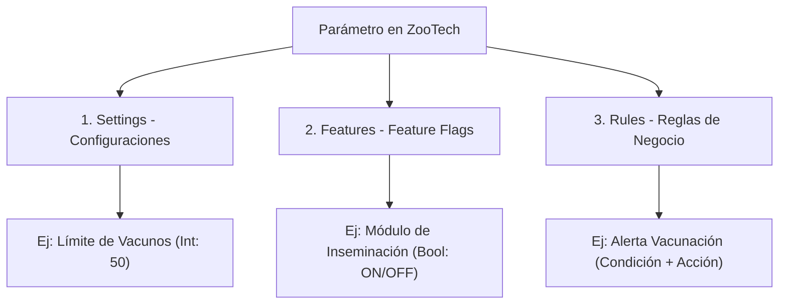
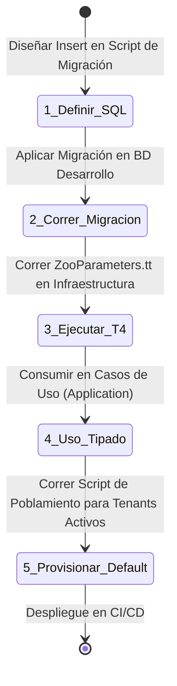

# Playbook de Gobernanza: Creación y Manejo de Parámetros (Settings, Features y Rules)

Este documento establece la estrategia, convenciones y contratos prácticos de desarrollo en **ZooTech** para asegurar que todo el equipo (Frontend, Backend, DBA y DevOps) esté coordinado al crear, modificar o eliminar parámetros globales o específicos de tenants.

---

## 📖 1. Glosario de Términos y Taxonomía

Para evitar confusiones en el equipo, definimos los límites conceptuales de cada elemento:



| Tipo | ¿Qué es? | Tipo de Dato | Mutabilidad en Ejecución | Ejemplo Práctico |
| :--- | :--- | :--- | :--- | :--- |
| **Settings** | Valores de control que modifican el *comportamiento* de una funcionalidad existente. | Fuertemente tipado (int, string, bool, decimal). | Alta (Editado por Tenant o Admin). | `MAX_PETS_PER_OWNER` |
| **Features** | Interruptores binarios (ON/OFF) que activan o desactivan *módulos completos* (por suscripción o despliegue progresivo). | Booleano implícito. | Baja (Normalmente atado a planes de pago). | `INVENTORY_MODULE` |
| **Rules** | Lógica estructurada dinámica (esquemas JSON de condiciones y acciones) que orquesta decisiones de negocio. | Objeto complejo (JSON). | Media (Personalizado por tenant). | `REMIND_VACCINATION` |

---

## 🛠️ 2. Flujo de Trabajo para Desarrolladores (Paso a Paso)

Cuando un desarrollador necesita agregar un nuevo parámetro, debe seguir estrictamente este flujo para no romper la compilación ni generar desajustes entre los ambientes (Dev, Staging, Prod):



### Paso 1: Diseñar e Insertar la Definición Global (SQL)
Toda definición nace en la base de datos de control plano (`TenantCatalogDb`). El desarrollador debe crear un script de migración SQL.

### Paso 2: Ejecutar la Generación de Código (T4)
El desarrollador ejecuta el archivo [ZooParameters.tt](file:///C:/Users/yonel/Desktop/Proyectos%20Programacion/.NET/Aplicaciones/ZooTech/ZooTech-Backend%20-%20Solution/src/ZooTech.Infrastructure/Configuration/ZooParameters.tt) desde Visual Studio o mediante consola (`dotnet t4`). Esto regenerará el archivo [ZooParameters.cs](file:///C:/Users/yonel/Desktop/Proyectos%20Programacion/.NET/Aplicaciones/ZooTech/ZooTech-Backend%20-%20Solution/src/ZooTech.Domain/Generated/ZooParameters.cs) en el proyecto de Dominio.

### Paso 3: Consumir en el Código (Application/Domain)
El desarrollador ahora tiene acceso autocompletado y tipado. No se permiten strings mágicos.

### Paso 4: Script de Migración de Datos para Tenants
Si un setting es obligatorio, se debe proveer un script que inserte el valor por defecto para todos los tenants existentes en la tabla `tenant_settings`.

---

## 📝 3. Plantillas y Contratos de Inserción SQL (Base de Datos)

Para mantener la base de datos limpia y ordenada, se deben usar las siguientes plantillas SQL al crear parámetros:

### A. Contrato para un nuevo **Setting**
*   **Regla de Nombramiento**: `UPPER_SNAKE_CASE` para el `code` y clasificarlo en una `category` existente o nueva en `PascalCase`.

```sql
-- Agregar Definición Global
INSERT INTO setting_definitions (code, name, category, data_type, default_value, validation_schema, is_required, is_sensitive, created_at, updated_at)
VALUES (
    'MAX_VETERINARIANS_LIMIT',                  -- code
    'Límite Máximo de Veterinarios Activos',    -- name
    'Billing',                                  -- category (Determina la sub-clase en C#)
    'INT',                                      -- data_type (INT | BOOLEAN | DECIMAL | STRING)
    '5',                                        -- default_value
    '{"minimum": 1, "maximum": 100}',           -- validation_schema (JSON para validar en el Admin API)
    1,                                          -- is_required
    0,                                          -- is_sensitive (Si se enmascara en auditoría)
    SYSDATETIMEOFFSET(),
    SYSDATETIMEOFFSET()
);

-- Poblar valor por defecto para todos los tenants existentes (Evita excepciones de valor faltante)
INSERT INTO tenant_settings (tenant_id, setting_definition_id, value, updated_at)
SELECT t.id, (SELECT id FROM setting_definitions WHERE code = 'MAX_VETERINARIANS_LIMIT'), '5', SYSDATETIMEOFFSET()
FROM tenants t;
```

### B. Contrato para una nueva **Feature**
*   **Regla de Nombramiento**: Prefijo del módulo seguido de la funcionalidad, ej. `PROD_MILK_ANALYSIS`.

```sql
INSERT INTO features (code, name, description, category, is_active, created_at, updated_at)
VALUES (
    'PROD_MILK_ANALYSIS',
    'Módulo de Análisis Avanzado de Calidad de Leche',
    'Habilita el ingreso de datos de laboratorio, acidez y porcentaje de grasa en los ordeños.',
    'Production',
    1, -- Activo por defecto en la plataforma
    SYSDATETIMEOFFSET(),
    SYSDATETIMEOFFSET()
);
```

---

## 💻 4. Ejemplo Práctico: Implementación de Código de Extremo a Extremo

### Escenario:
El equipo de Producto solicita limitar la cantidad de vacas que un tenant puede registrar en base a su plan de suscripción (`MAX_COWS_LIMIT`).

### 1. Inserción en Base de Datos (DBA/Dev)
Se corre el script SQL:
```sql
INSERT INTO setting_definitions (code, name, category, data_type, default_value, is_required, created_at)
VALUES ('MAX_COWS_LIMIT', 'Límite de Vacunos Registrados', 'Billing', 'INT', '100', 1, SYSDATETIMEOFFSET());
```

### 2. Generación T4 (Auto-generado en `ZooParameters.cs`)
Tras ejecutar el T4, la clase se actualiza automáticamente en la capa de Dominio:
```csharp
namespace ZooTech.Domain.Generated
{
    public static class ZooSettings
    {
        public static class Billing
        {
            /// <summary>
            /// Límite de Vacunos Registrados
            /// </summary>
            public static readonly SettingDefinition<int> MaxCowsLimit = new("MAX_COWS_LIMIT", 100);
        }
    }
}
```

### 3. Implementación en la Lógica del Caso de Uso (Backend Dev)
El programador inyecta `ITenantConfiguration` en el caso de uso de registro de vacas:

```csharp
namespace ZooTech.Application.Modules.Module_Ganaderia.UseCases.RegisterVacuno;

public class RegisterVacunoInteractor
{
    private readonly IVacunoRepository _vacunoRepository;
    private readonly ITenantConfiguration _config;
    private readonly ITenantContext _tenantContext;

    public RegisterVacunoInteractor(
        IVacunoRepository vacunoRepository,
        ITenantConfiguration config,
        ITenantContext tenantContext)
    {
        _vacunoRepository = vacunoRepository;
        _config = config;
        _tenantContext = tenantContext;
    }

    public async Task Handle(RegisterVacunoCommand cmd)
    {
        // Obtener el límite configurado para este Tenant específico (Caché L1 rápida)
        int maxCowsAllowed = _config.Get(ZooSettings.Billing.MaxCowsLimit);
        
        int currentCowsCount = await _vacunoRepository.CountActiveByTenantAsync(_tenantContext.TenantId);

        if (currentCowsCount >= maxCowsAllowed)
        {
            throw new BusinessRuleException($"Límite de suscripción alcanzado. Máximo permitido: {maxCowsAllowed} vacas.");
        }

        // Proceder con el registro...
    }
}
```

---

## 🔄 5. Contrato de API para Actualización e Invalidad (Sincronización)

Cuando un administrador modifica un valor de configuración a través del panel de control, el endpoint del API debe ejecutar la invalidación local y global en cascada.

### Ejemplo de Controlador de Gestión de Parámetros:

```csharp
namespace ZooTech.InterfaceAdapters.Modules.Module_Tenancing.Controllers;

[ApiController]
[Route("api/v1/admin/tenants/{tenantId}/settings")]
public class TenantSettingsAdminController : ControllerBase
{
    private readonly TenantCatalogDb _context;
    private readonly IConnectionMultiplexer _redis;
    private readonly IHubContext<ParameterSyncHub> _hubContext;

    public TenantSettingsAdminController(
        TenantCatalogDb context, 
        IConnectionMultiplexer redis,
        IHubContext<ParameterSyncHub> hubContext)
    {
        _context = context;
        _redis = redis;
        _hubContext = hubContext;
    }

    [HttpPut("{settingCode}")]
    public async Task<IActionResult> UpdateSetting(long tenantId, string settingCode, [FromBody] UpdateSettingRequestDto request)
    {
        // 1. Guardar en Base de Datos de Control Plane
        var dbSetting = await _context.tenant_settings
            .Include(ts => ts.setting_definition)
            .FirstOrDefaultAsync(ts => ts.tenant_id == tenantId && ts.setting_definition.code == settingCode);

        if (dbSetting == null) return NotFound();

        dbSetting.value = request.NewValue;
        dbSetting.updated_at = DateTimeOffset.UtcNow;
        await _context.SaveChangesAsync();

        // 2. Invalidar Caché L2 (Redis Key)
        var redisDb = _redis.GetDatabase();
        string cacheKey = $"tenant:{tenantId}:config";
        await redisDb.KeyDeleteAsync(cacheKey);

        // 3. Notificar a todas las APIs vía Redis Pub/Sub (Invalidación de Caché L1)
        var publisher = _redis.GetSubscriber();
        await publisher.PublishAsync("tenant-config-invalidation", tenantId.ToString());

        // 4. Notificar a los clientes Frontend conectados vía SignalR
        await _hubContext.Clients.Group($"tenant:{tenantId}")
            .SendAsync("ParameterUpdated", new { Type = "Setting", Code = settingCode });

        return Ok(GeneralResponseDTO<string>.Ok("Configuración actualizada y sincronizada en clúster."));
    }
}
```

---

## 🚨 6. Acuerdos de Niveles de Servicio Internos (SLA Técnicos)

Para asegurar estabilidad en producción, el equipo acuerda las siguientes métricas de rendimiento:

1.  **Latencia de Lectura**: El acceso a configuraciones desde cualquier caso de uso en la capa de aplicación debe tomar **menos de 2 microsegundos** gracias a la caché L1 local en memoria.
2.  **Tiempo de Sincronización en Clúster**: El desfase entre la actualización de una configuración por el administrador y su reflejo en todos los pods de Kubernetes / balanceador del backend no debe exceder **los 200 milisegundos**.
3.  **Manejo de Caída de Caché**: Si el servidor de Redis queda fuera de servicio, el backend debe degradarse con elegancia (Graceful Degradation) consultando directamente a la base de datos de control plano mediante SQL sin generar errores de disponibilidad de servicio (HTTP 503).
