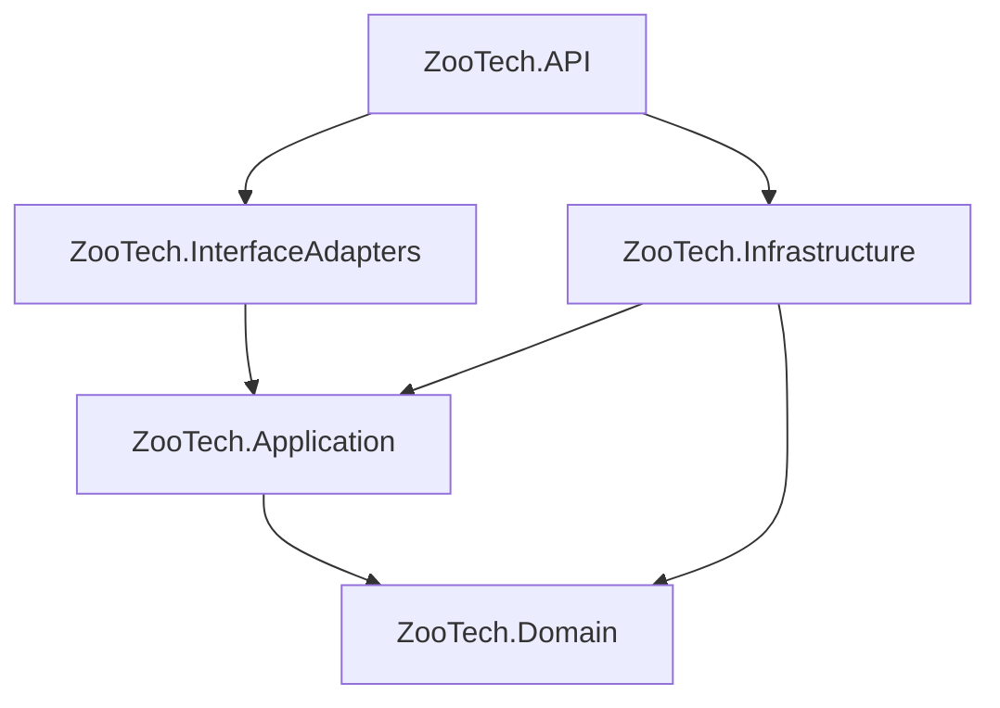

# Análisis del Proyecto: ZooTech Backend

**ZooTech** es un sistema backend empresarial desarrollado en **.NET 10.0** diseñado para la gestión integral de ganadería y producción de leche. Implementa una **Arquitectura Limpia (Clean Architecture)** con un esquema **Multitenant de base de datos por cliente** (Database-per-tenant).

---

## 🏛️ Estructura del Proyecto y Capas

El código está organizado en base a los principios de **Clean Architecture / Ports & Adapters (Hexagonal)**, con 5 proyectos en la carpeta `src/`:



**Dependencias reales entre proyectos:**

| Proyecto | Depende de |
|---|---|
| `ZooTech.Domain` | *(ninguno — núcleo puro sin dependencias externas)* |
| `ZooTech.Application` | `ZooTech.Domain` + FluentValidation, MediatR, DI.Abstractions |
| `ZooTech.Infrastructure` | `ZooTech.Domain`, `ZooTech.Application` + EF Core, MongoDB.Driver, StackExchange.Redis |
| `ZooTech.InterfaceAdapters` | `ZooTech.Application` + `FrameworkReference Microsoft.AspNetCore.App` |
| `ZooTech.API` | `ZooTech.Application`, `ZooTech.Infrastructure`, `ZooTech.InterfaceAdapters` + Swashbuckle, OpenApi |

> **Nota:** `ZooTech.Infrastructure` NO depende de `ZooTech.InterfaceAdapters`, ni viceversa. La API es el Composition Root que orquesta ambas.

---

### 1. 🌐 ZooTech.Domain — Capa de Dominio

Núcleo del negocio. Totalmente independiente de frameworks y bases de datos. Proyecto **net10.0** con **0 dependencias NuGet**.

```
ZooTech.Domain/
├── Entities/
│   └── TenantDomainEntity.cs        # Única entidad implementada
├── Enums/
│   └── TenantStatus.cs              # TRIAL, ACTIVE, SUSPENDED, INACTIVE
├── ValueObjects/                    # ⚠️ Vacío (solo .gitkeep)
├── Exceptions/                      # ⚠️ Vacío (solo .gitkeep)
└── Rules/                           # ⚠️ Vacío (solo .gitkeep)
```

**Entidad principal — `TenantDomainEntity`:**
- Propiedades: `Id`, `Code` (setter privado), `SubDomain`, `DisplayName`, `LegalName`, `Email`, `Phone`, `Status` (TenantStatus), `Metadata`, `CreatedAt` (setter privado), `UpdatedAt`
- Creada mediante **factory method**: `TenantDomainEntity.Create(...)` — constructor privado obliga a usar el factory
- `Code` y `CreatedAt` son inmutables después de la creación (private set)

**⚠️ Archivos a limpiar:** `Class1.cs` (stub por defecto) en la raíz del proyecto.

---

### 2. 📖 ZooTech.Application — Capa de Aplicación

Implementa los casos de uso usando **CQRS con MediatR** y **puertos (ports)** estilo hexagonal.

```
ZooTech.Application/
├── Common/
│   ├── Behaviors/
│   │   ├── IPipelineBehavior.cs         # ⚠️ Interface CUSTOM que duplica MediatR.IPipelineBehavior
│   │   ├── ValidationBehavior.cs        # Implementado — ejecuta validadores FluentValidation
│   │   └── LoggingBehavior.cs           # Esqueleto vacío
│   ├── Exceptions/
│   │   ├── AppException.cs              # Base abstracta (StatusCode, Code, Message, Details)
│   │   ├── ValidationException.cs       # HTTP 400
│   │   ├── NotFoundException.cs         # HTTP 404
│   │   └── TenantProvisioningException.cs  # HTTP 500
│   ├── Gateway/                         # 🚪 Secondary Ports (driven)
│   │   ├── Auditing/    ─ IAppAuditService
│   │   ├── Caching/     ─ IAppCacheService
│   │   ├── Context/     ─ ITenantContext (TenantId, Code, SubDomain, DatabaseName)
│   │   ├── Tenant/      ─ ITenantStore, ITenantProvisioningService, TenantInfo
│   │   └── Repositories/MainTenantsDb/ ─ ITenantRepository
│   ├── Models/
│   │   └── GeneralResponseDTO.cs
│   └── Validator/
│       └── IValidator.cs                # ⚠️ Interface genérica CUSTOM (no usada)
└── Modules/
    ├── Module_Tenancing/                # ✅ Módulo implementado
    │   └── UseCases/
    │       ├── CreateTenant/            # Comando + Handler + Interactor + Output + Validator + Ports
    │       └── ListTenants/             # ⚠️ Vacío (solo .gitkeep)
    └── Module_ProduccionLeche/          # ⚠️ Vacío (solo .gitkeep)
        └── UseCases/
```

**Patrón de un caso de uso (CreateTenant):**
1. `CreateTenantCommand` : `IRequest<Unit>` — datos de entrada (hereda de MediatR)
2. `CreateTenantValidator` : `AbstractValidator<CreateTenantCommand>` — validación con FluentValidation
3. `CreateTenantHandler` : `IRequestHandler<CreateTenantCommand, Unit>` — handler de MediatR (delega al InputPort)
4. `CreateTenantInteractor` : `ICreateTenantInputPort` — lógica de negocio del caso de uso
5. `CreateTenantPresenter` (en InterfaceAdapters) : `ICreateTenantOutputPort` — captura la salida para la respuesta HTTP

**⚠️ Inconsistencias detectadas:**
- **Custom `IPipelineBehavior`**: La aplicación define su propia interfaz `ZooTech.Application.Common.Behaviors.IPipelineBehavior<TRequest, TResponse>` que tiene la misma firma que `MediatR.IPipelineBehavior<TRequest, TResponse>`. `ValidationBehavior` implementa la *custom*, no la de MediatR. Esto se registra en `Program.cs` como `typeof(ZooTech.Application.Common.Behaviors.IPipelineBehavior<,>)` en lugar de usar la interfaz nativa de MediatR. Esto es confuso y debería unificarse.
- `MediatR 14.1.0` ya incluye `IPipelineBehavior` nativamente; la versión custom es redundante.
- **`DependencyInjection.cs`**: Todo el código está comentado. El registro real de MediatR, validadores y behaviors se hace **inline en `Program.cs`**.
- **Gateway `IValidator<T>`**: Interfaz custom obsoleta, no se usa en ninguna parte.
- **Gateway `IConfiguration`**: Interfaz vacía sin miembros.

---

### 3. 💾 ZooTech.Infrastructure — Capa de Infraestructura

Implementa las interfaces definidas en Application. Contiene toda la lógica de persistencia, caching, auditoría y tenant.

```
ZooTech.Infrastructure/
├── Persistence/
│   ├── Context/
│   │   ├── TenantCatalogDb.cs           # DbContext GLOBAL (catálogo de tenants) ✅ COMPLETO
│   │   ├── GanaderiaDbContext.cs        # DbContext POR TENANT (ganadería)
│   │   ├── GanaderiaDbContextFactory.cs # Factory para cualquier connection string (provisioning)
│   │   └── IGanaderiaDbContextFactory.cs
│   ├── Entities/
│   │   ├── MainTenantsDb/               # 16 entidades EF para TenantCatalogDb
│   │   └── GanaderiaDb/                 # 47+ entidades EF para GanaderiaDbContext
│   ├── Mappers/
│   │   └── MainTenantsDb/
│   │       └── TenantMapper.cs          # Convierte tenant (EF) ↔ TenantDomainEntity (dominio)
│   ├── Migrations/
│   │   └── Ganaderia/                   # Migración inicial (2026-05-20) — 39 tablas + 4 vistas
│   └── Repositories/
│       └── MainTenantsDb/
│           └── TenantRepository.cs      # ⚠️ Stub vacío
├── Tenant/
│   ├── TenantContext.cs                 # Implementa ITenantContext (scoped por request)
│   ├── TenantStore.cs                   # Implementa ITenantStore (con caché en memoria de 5 min)
│   ├── TenantProvisioningService.cs     # Implementa ITenantProvisioningService
│   ├── TenantDatabaseMigrator.cs        # Implementa ITenantDatabaseMigrator
│   ├── TenantDbContextFactory.cs        # Factory para el tenant ACTUAL (usa ITenantContext)
│   └── ITenantDbContextFactory.cs
├── Caching/
│   ├── Garnet/                          # Cache activo (StackExchange.Redis + Garnet)
│   └── Redis/                           # Cache alternativo (StackExchange.Redis + Redis)
├── Auditing/
│   └── MongoDb/                         # Auditoría en MongoDB (MongoDbAudit)
└── DependencyInjection.cs               # Solo registra GanaderiaDbContext y GarnetCache
```

#### Base de Datos Central: `TenantCatalogDb` (Catálogo de Tenants)

| Tabla | Propósito |
|---|---|
| `tenants` | Registro maestro de cada tenant |
| `tenant_database_connections` | Conexión de BD del tenant (1 a 1 con tenant) |
| `tenant_brandings` | Branding del tenant (1 a 1) |
| `addresses` | Dirección del tenant (1 a 1) |
| `admin_users` | Usuarios administradores |
| `refresh_tokens` | Tokens de refresco de admin_users |
| `setting_groups` | Grupos de configuración (reemplaza el campo `category`) |
| `setting_definitions` | Definiciones globales de settings (FK → setting_group) |
| `setting_values` | Valores de settings por tenant/actor (patrón polimórfico actor_type/actor_id) |
| `features` | Catálogo de funcionalidades disponibles (feature flags) |
| `tenant_features` | Asignación features ↔ tenant (muchos a muchos) |
| `rule_definitions` | Definiciones de reglas de negocio |
| `tenant_business_rules` | Reglas asignadas a tenant (muchos a muchos) |

> **⚠️ `tenant_setting.cs`**: Existe como archivo en `Persistence/Entities/MainTenantsDb/` pero es una **entidad orphaned** — no tiene DbSet ni Fluent API en TenantCatalogDb. Fue reemplazada por `setting_values`.

#### Base de Datos por Tenant: `GanaderiaDbContext` (Esquema Ganadero)

**39 tablas + 4 vistas** (~722 líneas de configuración en DbContext).

| Categoría | Entidades | Propósito |
|---|---|---|
| **Catálogos** | `cat_raza`, `cat_color`, `cat_sexo`, `cat_estado_vacuno`, `cat_tipo_adquisicion`, `cat_tipo_peso`, `cat_tipo_fecundacion`, `cat_tipo_responsable`, `cat_tipo_utilizacion`, `cat_tipo_archivo`, `cat_tipo_reporte`, `cat_formato_reporte`, `cat_modulo`, `cat_estado_celo`, `cat_estado_fecundacion_vacuno`, `cat_estado_ordenio`, `cat_estado_registro`, `cat_estado_sequium`, `cat_estado_trazabilidad`, `cat_caracteristica_celo`, `cat_resultado_fecundacion` | Estandarización de datos maestros |
| **Hato** | `vacuno`, `granja`, `vacuno_adquisicion`, `vacuno_foto`, `vacuno_estado_historial`, `vacuno_estado_fecundacion_historial`, `vacuno_utilizacion_historial` | Registro individual del ganado y su trazabilidad |
| **Reproducción** | `celo_configuracion`, `celo_registro`, `celo_registro_caracteristica_libre`, `fecundacion`, `fecundacion_inseminacion`, `fecundacion_donante`, `fecundacion_embrion`, `fecundacion_crium` | Control de celo, inseminación y embriones |
| **Producción** | `ordenio`, `produccion_leche_estandar` | Sesiones de ordeño y estándares de producción |
| **Salud** | `triaje`, `incidente_vacuno`, `periodo_sequium` | Control clínico, peso, enfermedades y periodo seco |
| **Configuración** | `parametro_sistema`, `responsable`, `reproductor_externo`, `archivo`, `usuario`, `bitacora_auditorium` | Parametros del sistema y auditoría |
| **Reportes** | `reporte_descarga` | Reportes con filtros |
| **Vistas** | `v_celo_estado_vacuno`, `v_produccion_leche_estandar_vigente`, `v_vacuno_estado_vigente`, `v_vacuno_utilizacion_vigente` | Vistas de consulta |

#### Estrategia de Caching

- **Activo:** `GarnetCacheService` (Garnet es un caché compatible con Redis de Microsoft)
- **Alternativo:** `RedisCacheService` (misma interfaz, distinta config key: `Redis:ConnectionString`)
- **Abstracción:** `IAppCacheService` con método `GetOrCreateAsync<T>(key, factory)`
- **Serialización:** `System.Text.Json` en ambos
- **TenantStore** también usa `IMemoryCache` con expiración de 5 minutos

#### Estrategia de Auditoría

`MongoDbAudit` implementa `IAppAuditService` y registra eventos de auditoría en MongoDB con:
- `tenant_id`, `tenant_code`, `event_type`, `action`
- `user` (id, name), `old_values`, `new_values`
- `created_at`

**⚠️ No está registrado en DI** — pendiente de conexión.

---

### 4. 🔀 ZooTech.InterfaceAdapters — Capa de Adaptadores

Actúa como puente entre la API HTTP y los casos de uso. Contiene controladores, presenters, middlewares y mapeadores.

```
ZooTech.InterfaceAdapters/
├── Middleware/
│   ├── TenantResolutionMiddleware.cs    # Resuelve tenant por subdominio
│   └── ExceptionHandlingMiddleware.cs   # Manejo global de excepciones
├── Modules/
│   ├── Module_Tenancing/                # ✅ Implementado
│   │   ├── Controllers/TenancingController.cs
│   │   ├── DTOs/{Requests,Responses}/
│   │   ├── Mappers/CreateTenantMapper.cs
│   │   └── Presenters/CreateTenantPresenter.cs
│   └── Module_ProduccionLeche/          # ⚠️ En scaffolding
│       ├── Controllers/HomeController.cs
│       └── Presentes/                   # ⚠️ TYPO: debería ser "Presenters"
├── DTOs/
│   └── GeneralResponseDTO.cs            # DTO compartido para respuestas
├── Filters/                             # ⚠️ Vacío
└── DependencyInjection.cs               # ⚠️ TODO comentado (no se usa)
```

**Middleware:**
| Middleware | Orden | Función |
|---|---|---|
| `TenantResolutionMiddleware` | 1º | Extrae subdominio del host, busca tenant via `ITenantStore`, setea `ITenantContext` |
| `ExceptionHandlingMiddleware` | 2º | Captura `AppException` → respuesta JSON estructurada con código HTTP dinámico |

**Controladores:**
| Controller | Ruta | Endpoints |
|---|---|---|
| `HomeController` | `api/v1/home` | `GET /health`, `GET /` — endpoints públicos de health check |
| `TenancingController` | `tenancing` | `POST /tenancing` — crear tenant |

**Patrón del Presenter:**
`CreateTenantPresenter` implementa `ICreateTenantOutputPort` (definido en Application). La instancia se registra en DI tanto como clase concreta (`CreateTenantPresenter`) como interfaz (`ICreateTenantOutputPort`), compartiendo la misma instancia via `GetRequiredService<CreateTenantPresenter>()`. Esto permite que el Interactor (en Application) escriba el resultado y el Controller lo lea desde la misma instancia.

**⚠️ Código muerto detectado:**
- `TenancingController` inyecta `ICreateTenantInputPort _createTenantInputPort` pero nunca lo usa. Usa `IMediator` en su lugar. Esto sugiere que el flujo pasó de ser InputPort-driven a MediatR-driven, pero la dependencia muerta no se eliminó.

---

### 5. 🚀 ZooTech.API — Composition Root

Punto de entrada de la aplicación. **No contiene controladores ni middleware** — todo está en InterfaceAdapters (descubierto via `AddApplicationPart`).

**Registro de Servicios** (en orden de `Program.cs`):
1. `AddControllers()` + `AddApplicationPart(typeof(HomeController).Assembly)`
2. `AddEndpointsApiExplorer()` + `AddSwaggerGen` (3 docs: `auth`, `users`, `public`)
3. `AddApplication()` — **esqueleto vacío** (no registra nada real)
4. `AddInfrastructure(config)` — registra `GanaderiaDbContext` y `GarnetCacheService`
5. `AddDbContext<TenantCatalogDb>` — SQL Server con `TenantCatalogConnection`
6. `AddMemoryCache()`
7. MediatR + FluentValidation + Behaviors — inline
8. Servicios específicos (TenantStore, TenantContext, TenantProvisioningService, etc.)
9. CORS (`AllowFrontend`)
10. Middleware pipeline

**Pipeline de Middleware:**
```
TenantResolutionMiddleware → ExceptionHandlingMiddleware → Swagger/SwaggerUI (dev) → HttpsRedirection → Authorization → MapControllers
```

**Configuración Swagger:** 3 documentos (`auth`, `users`, `public`) visibles solo en Development.

---

## 🛢️ Estrategia Multitenant (Database per Tenant)

### Flujo de una Request

```
1. HTTP Request → Host: "{subdomain}.zootech.com"
       │
2. TenantResolutionMiddleware
   ├── Extrae subdominio del host
   ├── Busca en TenantStore.GetBySubDomainAsync(subdomain)
   │     └── TenantStore: 1º busca en IMemoryCache (5 min), 2º consulta TenantCatalogDb
   ├── Si no existe o tenant inactivo → HTTP 404
   └── Setea ITenantContext.SetTenant(id, code, subDomain, dbName)
       │
3. Controlador (ej. TenancingController.CreateTenant)
   ├── Recibe DTO
   ├── Mapea a CreateTenantCommand (mapper manual)
   └── Envía via IMediator.Send(command)
       │
4. ValidationBehavior (pipeline)
   └── Ejecuta CreateTenantValidator
       │
5. CreateTenantHandler (MediatR handler)
   └── Delega a ICreateTenantInputPort.Handle(command)
       │
6. CreateTenantInteractor
   ├── Llama ITenantProvisioningService.ProvisionAsync(cmd)
   │     ├── Crea tenant en TenantCatalogDb (incluye address, db_connection, branding)
   │     ├── Construye connection string para BD del tenant (formato: ZooTech_{Code}_Db)
   │     └── Llama TenantDatabaseMigrator.MigrateAsync(conn)
   │           └── Aplica migraciones EF a la BD del nuevo tenant
   └── Llama ICreateTenantOutputPort.Ok(output)
       │
7. CreateTenantPresenter almacena CreateTenantResponseDto
       │
8. Controller → Ok(_tenancingPresenter.Response)
```

### Flujo de Aprovisionamiento de Tenant (Provisioning)

```
TenantProvisioningService.ProvisionAsync(CreateTenantCommand)
  │
  ├── 1. Genera nombre BD: "ZooTech_{Code}_Db"
  ├── 2. Crea entidad tenant (con address, branding, db_connection)
  ├── 3. Guarda en TenantCatalogDb.tenants.Add(tenant)
  ├── 4. Construye connection string (template "TenantTemplate" + reemplaza InitialCatalog)
  └── 5. Llama TenantDatabaseMigrator.MigrateAsync(conn)
        └── Usa GanaderiaDbContextFactory.Create(conn) → context.Database.MigrateAsync()
```

### Fábricas de DbContext

| Factory | Propósito | Estado |
|---|---|---|
| `GanaderiaDbContextFactory` | Crea GanaderiaDbContext para **cualquier** connection string (usado en provisioning) | ✅ Implementado, registrado en DI |
| `TenantDbContextFactory` | Crea GanaderiaDbContext para el **tenant actual** (usa ITenantContext.DatabaseName) | ⚠️ Existe pero NO registrado en DI |

---

## 🧪 Estructura de Pruebas

**7 proyectos de prueba en total: 4 Unit + 3 Integration.**

### Pruebas Unitarias (`tests/Unit/`)

| Proyecto | Estado |
|---|---|
| `ZooTech.Domain.UnitTests` | ⚠️ Solo stub `UnitTest1.cs` |
| `ZooTech.Application.UnitTests` | ⚠️ Solo stub `UnitTest1.cs` |
| `ZooTech.Infrastructure.UnitTests` | ✅ **El único con pruebas reales** — 3 archivos con 6 tests |
| `ZooTech.InterfaceAdapters.UnitTests` | ⚠️ Solo 1 test real (TenantResolutionMiddleware) + stub |

**Pruebas reales existentes:**
| Archivo | Métodos | Lo que prueba |
|---|---|---|
| `TenantProvisioningServiceUnitTests` | 2 | Provisioning exitoso + fallo en migración |
| `TenantStoreUnitTests` | 4 | Búsqueda por subdominio, tenant inactivo, caché en memoria |
| `TenantDbContextFactoryUnitTests` | 1 | Creación de contexto con BD del tenant correcta |
| `TenantResolutionMiddlewareUnitTests` | 2 | Resolución de tenant por subdominio, 404 para localhost |

### Pruebas de Integración (`tests/Integration/`)

| Proyecto | Estado |
|---|---|
| `ZooTech.API.IntegrationTests` | ⚠️ Solo stub |
| `ZooTech.Infrastructure.IntegrationTests` | ⚠️ Solo stub |
| `ZooTech.InterfaceAdapters.IntegrationTests` | ⚠️ Solo stub |

**Stack tecnológico de pruebas:** xUnit 2.9.3, Moq 4.20.72, FluentAssertions 8.10.0 (declarado pero no usado), EF Core InMemory 10.0.8.

> **Nota:** `FluentAssertions` está declarado en `Infrastructure.UnitTests.csproj` pero los tests usan `Assert.*` clásico.

---

## ⚠️ Observaciones y Deudas Técnicas

### Inconsistencias Arquitectónicas

1. **Dualidad MediatR + InputPort/OutputPort**: El caso de uso `CreateTenant` usa AMBOS patrones simultáneamente: el handler de MediatR (`CreateTenantHandler`) delega al `CreateTenantInteractor` (InputPort), que a su vez usa `ICreateTenantOutputPort`. El controller, sin embargo, usa `IMediator.Send()` directamente (ignorando el `ICreateTenantInputPort` inyectado). Esto es código muerto y confusión arquitectónica — debería elegirse UNO de los dos estilos.

2. **Custom IPipelineBehavior**: Define su propia interfaz duplicando `MediatR.IPipelineBehavior`. `ValidationBehavior` implementa la custom, y `Program.cs` la registra con nombre fully-qualified. Debería eliminarse la custom y usar la interfaz nativa de MediatR.

3. **DI fragmentado**: Los `DependencyInjection.cs` de Application e InterfaceAdapters están comentados. El registro real está esparcido en `Program.cs`. Esto dificulta el mantenimiento.

4. **TenantDbContextFactory no registrado**: Existe pero no está conectado en DI. El `GanaderiaDbContext` que se resuelve en requests reales sería el registrado con `DefaultConnection` (no el del tenant dinámico).

5. **Mappers duplicados**: `TenantMapper` (Infrastructure) y `CreateTenantMapper` (InterfaceAdapters) hacen mapping manual similar pero en distintas capas.

### Código Muerto / Stubs a Limpiar

| Archivo | Problema |
|---|---|
| `ZooTech.Domain/Class1.cs` | Stub autogenerado |
| `ZooTech.Infrastructure/Class1.cs` | Stub autogenerado |
| `TenancingController._createTenantInputPort` | Inyectado pero nunca usado |
| `Application.Common.Behaviors.LoggingBehavior` | Clase vacía |
| `Application.Common.Behaviors.IPipelineBehavior` | Duplicado de interfaz de MediatR |
| `Application.Common.Validator.IValidator` | Interfaz no utilizada |
| `Application.Common.Gateway.Configuration.IConfiguration` | Interfaz vacía |
| `Infrastructure.Persistence.Repositories.MainTenantsDb.TenantRepository` | Stub vacío |
| `Infrastructure.Persistence.Entities.MainTenantsDb.tenant_setting.cs` | Entidad orphaned (sin DbSet, sin Fluent API, sin navegación) — reemplazada por `setting_value` |
| `InterfaceAdapters.Modules.Module_ProduccionLeche.Presentes/` | ⚠️ Typo en carpeta (Presentes → Presenters) |

### Cobertura de Pruebas

- Solo 6 pruebas reales en toda la solución
- Sin pruebas de integración implementadas
- Sin pruebas unitarias para Domain, Application, ni la mayoría de InterfaceAdapters
- Sin shared test utilities (cada test configura sus propios mocks inline)

### Dependencias y Configuración

- **Target .NET 10.0** (versión preview — verificar disponibilidad en entornos target)
- **EF Core 10.0.7** con SQL Server
- **MediatR 14.1.0** con FluentValidation 12.1.1
- **Dos tecnologías de caché** (Garnet activo, Redis alternativo)
- **Auditoría en MongoDB** (pendiente de activación en DI)
- **Sin integración con identidad/autenticación** (carpetas Identity vacías)

---

## 💡 Recomendaciones para Próximas Modificaciones Arquitectónicas

### Prioridad Alta

1. **Unificar el patrón de casos de uso**: Decidir si se usa MediatR puro (handler directo con lógica) o Ports & Adapters (InputPort/OutputPort). La combinación actual es redundante. Se recomienda mantener MediatR como orquestador y eliminar la capa de InputPort/OutputPort a nivel de caso de uso (las gateway interfaces sí deben mantenerse).

2. **Consolidar Dependency Injection**: Mover todo el registro de servicios a los respectivos `DependencyInjection.cs` de cada capa y mantener `Program.cs` únicamente como orquestador de llamadas `Add{Layer}()`.

3. **Eliminar Custom IPipelineBehavior**: Usar `MediatR.IPipelineBehavior<TRequest, TResponse>` directamente y eliminar `ZooTech.Application.Common.Behaviors.IPipelineBehavior`.

### Prioridad Media

4. **Activar TenantDbContextFactory en DI** para que el `GanaderiaDbContext` se resuelva dinámicamente por tenant. Actualmente solo existe un factory que no se usa.

5. **Implementar pruebas de integración** para el flujo completo de aprovisionamiento de tenant.

6. **Centralizar mappers**: Evaluar AutoMapper o crear mappers estáticos consistentes en cada capa.

7. **Renombrar carpeta `Presentes`** a `Presenters` en `Module_ProduccionLeche`.

### Prioridad Baja

8. **Implementar Value Objects** en Domain (ej. `TenantCode`, `Email`, `Phone`) para encapsular reglas de formato.

9. **Implementar excepciones de dominio** en la carpeta `Domain/Exceptions/`.

10. **Activar MongoDB Audit** registrando `MongoDbAudit` e integrándolo con EF Core interceptor.

11. **Limpiar stubs**: Eliminar `Class1.cs` en Domain e Infrastructure.

12. **Evaluar si mantener dualidad Garnet/Redis** o elegir una sola tecnología de caché.

---

## 📦 Feature en Desarrollo: Parametrización (T4 + Caché Híbrida + SignalR)

Se está implementando un sistema de parametrización multi-tenant con código fuertemente tipado generado por T4, caché híbrida L1/L2 y sincronización en tiempo real via SignalR.

**Documentación de diseño:**
| Archivo | Contenido |
|---|---|
| [`parametrizacion/parameterization_architecture.md`](parametrizacion/parameterization_architecture.md) | Arquitectura completa, diagramas, especificación de componentes y código de implementación |
| [`parametrizacion/parameterization_governance.md`](parametrizacion/parameterization_governance.md) | Gobernanza, contratos SQL, SLAs, mapeo de tipos y estrategia de pruebas |
| [`parametrizacion/parameterization_implementation_plan.md`](parametrizacion/parameterization_implementation_plan.md) | Plan de implementación paso a paso (guía para agente de código) |

**Resumen de lo que agrega esta feature:**
- 3 tipos de parámetros: `Settings` (valores tipados), `Features` (flags ON/OFF), `Rules` (esquemas JSON)
- Código C# estático fuertemente tipado (`ZooSettings.Billing.MaxCowsLimit`) generado automáticamente por T4 desde la BD
- Agrupación de settings por entidad `setting_group` (reemplaza el campo `category`)
- Valores por tenant via `setting_value` con patrón polimórfico `actor_type`/`actor_id`
- Caché híbrida L1 (ConcurrentDictionary en memoria) + L2 (Redis) con invalidación en cascada
- Sincronización multi-instancia via Redis Pub/Sub
- Notificación a frontend en tiempo real via SignalR con backplane Redis
- CRUD de parámetros por tenant via API REST + MediatR
- Modelo de datos ya actualizado: `setting_group`, `setting_definition` (FK a grupo), `setting_value`, `TenantCatalogDb` cableado
- **⚠️ `tenant_setting.cs` es código muerto** — debe eliminarse antes de implementar
