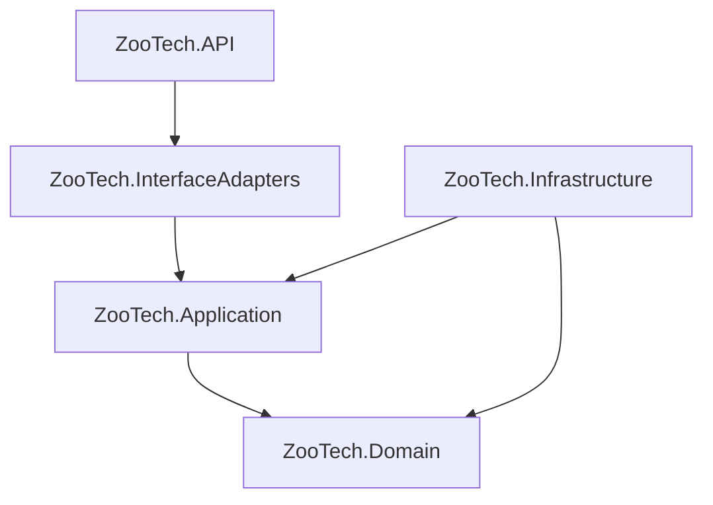

# Análisis del Proyecto: ZooTech Backend

**ZooTech** es un sistema backend empresarial desarrollado en **.NET** diseñado para la gestión integral de ganadería y producción de leche. Implementa una **Arquitectura Limpia (Clean Architecture)** con un esquema **Multitenant de base de datos por cliente** (Database-per-tenant).

---

## 🏛️ Estructura del Proyecto y Capas

El código está organizado en base a los principios de **Clean Architecture / Ports & Adapters (Hexagonal)**, lo que facilita el desacoplamiento de la lógica de negocio frente a la infraestructura y frameworks externos.

### 1. 🌐 [ZooTech.Domain](file:///C:/Users/yonel/Desktop/Proyectos%20Programacion/.NET/Aplicaciones/ZooTech/ZooTech-Backend%20-%20Solution/src/ZooTech.Domain)
Contiene el núcleo del negocio. Es totalmente independiente de cualquier framework o base de datos.
*   **Entidades**: Modelos ricos como [TenantDomainEntity.cs](file:///C:/Users/yonel/Desktop/Proyectos%20Programacion/.NET/Aplicaciones/ZooTech/ZooTech-Backend%20-%20Solution/src/ZooTech.Domain/Entities/TenantDomainEntity.cs).
*   **Enums**: Estados, sexos, tipos de datos.
*   **Reglas y Excepciones**: Validación intrínseca de dominio.

### 2. 📖 [ZooTech.Application](file:///C:/Users/yonel/Desktop/Proyectos%20Programacion/.NET/Aplicaciones/ZooTech/ZooTech-Backend%20-%20Solution/src/ZooTech.Application)
Implementa los casos de uso del sistema. Orquesta el flujo de datos hacia y desde las entidades.
*   **Patrón Mediator**: Utiliza `MediatR` para desacoplar comandos y consultas (`Commands` / `Queries`).
*   **Validaciones**: `FluentValidation` valida los comandos en un pipeline behavior antes de que lleguen a los manejadores (`ValidationBehavior`).
*   **Puertos (Ports)**: Interfaces de entrada/salida (`InputPort`/`OutputPort`) que definen cómo interactúa el exterior con los casos de uso.
*   **Módulos**: Organizados por carpetas como `Module_Tenancing` (con casos de uso como `CreateTenant` y `ListTenants`).

### 3. 💾 [ZooTech.Infrastructure](file:///C:/Users/yonel/Desktop/Proyectos%20Programacion/.NET/Aplicaciones/ZooTech/ZooTech-Backend%20-%20Solution/src/ZooTech.Infrastructure)
Implementa las interfaces definidas en las capas internas, interactuando con bases de datos y servicios externos.
*   **Tenant Catalog DB**: Centralizado en [TenantCatalogDb.cs](file:///C:/Users/yonel/Desktop/Proyectos%20Programacion/.NET/Aplicaciones/ZooTech/ZooTech-Backend%20-%20Solution/src/ZooTech.Infrastructure/Persistence/Context/TenantCatalogDb.cs). Almacena los tenants registrados, sus subdominios, estados y cadenas de conexión de base de datos.
*   **Ganadería DB**: Gestionado por [GanaderiaDbContext.cs](file:///C:/Users/yonel/Desktop/Proyectos%20Programacion/.NET/Aplicaciones/ZooTech/ZooTech-Backend%20-%20Solution/src/ZooTech.Infrastructure/Persistence/Context/GanaderiaDbContext.cs). Representa el esquema de base de datos de cada tenant.
*   **Aprovisionamiento de Tenant**: [TenantProvisioningService.cs](file:///C:/Users/yonel/Desktop/Proyectos%20Programacion/.NET/Aplicaciones/ZooTech/ZooTech-Backend%20-%20Solution/src/ZooTech.Infrastructure/Tenant/TenantProvisioningService.cs) automatiza la creación de bases de datos individuales para cada tenant bajo la nomenclatura `ZooTech_{TenantCode}_Db`, aplicando migraciones automáticamente con [TenantDatabaseMigrator.cs](file:///C:/Users/yonel/Desktop/Proyectos%20Programacion/.NET/Aplicaciones/ZooTech/ZooTech-Backend%20-%20Solution/src/ZooTech.Infrastructure/Tenant/TenantDatabaseMigrator.cs).

### 4. 🔀 [ZooTech.InterfaceAdapters](file:///C:/Users/yonel/Desktop/Proyectos%20Programacion/.NET/Aplicaciones/ZooTech/ZooTech-Backend%20-%20Solution/src/ZooTech.InterfaceAdapters)
Actúa como adaptador entre los casos de uso y la API HTTP.
*   **Controladores**: Exponen los endpoints (ej. [TenancingController.cs](file:///C:/Users/yonel/Desktop/Proyectos%20Programacion/.NET/Aplicaciones/ZooTech/ZooTech-Backend%20-%20Solution/src/ZooTech.InterfaceAdapters/Modules/Module_Tenancing/Controllers/TenancingController.cs) y [HomeController.cs](file:///C:/Users/yonel/Desktop/Proyectos%20Programacion/.NET/Aplicaciones/ZooTech/ZooTech-Backend%20-%20Solution/src/ZooTech.InterfaceAdapters/Modules/Module_ProduccionLeche/Controllers/HomeController.cs)).
*   **Presenters**: Mapean las salidas de los casos de uso (`CreateTenantOutput`) a las respuestas HTTP.
*   **DTOs y Mappers**: Transforman los objetos de solicitud HTTP a comandos de MediatR.

### 5. 🚀 [ZooTech.API](file:///C:/Users/yonel/Desktop/Proyectos%20Programacion/.NET/Aplicaciones/ZooTech/ZooTech-Backend%20-%20Solution/src/ZooTech.API)
El punto de entrada de la aplicación.
*   **Program.cs**: Configuración del pipeline de ASP.NET Core, Inyección de Dependencias (DI), Middleware (como `TenantResolutionMiddleware` y `ExceptionHandlingMiddleware`), CORS y Swagger.
*   **Swagger Multi-Documento**: Configura tres grupos de API distintos: `public` (endpoints generales), `auth` (autenticación) y `users` (gestión de usuarios).

---

## 🛢️ Modelo de Datos de Ganadería (`GanaderiaDbContext`)

El contexto principal del negocio contiene tablas robustas orientadas a la administración de hatos ganaderos:

| Categoría | Entidades Principales | Propósito |
| :--- | :--- | :--- |
| **Hato Ganadero** | `vacunos`, `granjas` | Registro individual del ganado (raza, color, sexo, fecha de nacimiento, procedencia) y la estructura de granjas. |
| **Producción** | `ordenios` | Sesiones de ordeño, volúmenes de leche recolectada y estados de ordeño. |
| **Reproducción** | `celo_registros`, `fecundacions` | Control de celo, inseminaciones artificiales, monta natural, embriones, y seguimiento de preñez/partos. |
| **Salud y Control** | `triajes`, `incidente_vacunos` | Control clínico, registros de peso, enfermedades y tratamientos médicos. |
| **Configuraciones / Catálogos** | `cat_raza`, `cat_color`, `cat_sexo`, `cat_estado_vacuno`, `geo_departamentos`, etc. | Catálogos parametrizados para estandarizar los datos del ganado y geografía. |

---

## 🧪 Estructura de Pruebas

El proyecto cuenta con una cobertura estructurada para pruebas:
*   📂 **[tests/Unit](file:///C:/Users/yonel/Desktop/Proyectos%20Programacion/.NET/Aplicaciones/ZooTech/ZooTech-Backend%20-%20Solution/tests/Unit)**: Pruebas unitarias de Domain, Application, Infrastructure e InterfaceAdapters.
*   📂 **[tests/Integration](file:///C:/Users/yonel/Desktop/Proyectos%20Programacion/.NET/Aplicaciones/ZooTech/ZooTech-Backend%20-%20Solution/tests/Integration)**: Pruebas de integración para API, Infrastructure e InterfaceAdapters (interacción real con bases de datos y solicitudes HTTP).

---

## 💡 Estrategia Multitenant (Database per Tenant)

1.  **Resolución de Tenant**: La petición HTTP llega y un `TenantResolutionMiddleware` detecta el tenant (usualmente mediante el subdominio o encabezados).
2.  **Inyección de Conexión**: Se recupera la cadena de conexión del tenant desde `TenantCatalogDb` y se inyecta dinámicamente en el `GanaderiaDbContext` mediante un `GanaderiaDbContextFactory`.
3.  **Aislamiento Total**: Cada tenant posee su propia base de datos física, garantizando la seguridad, rendimiento e independencia de los datos.
